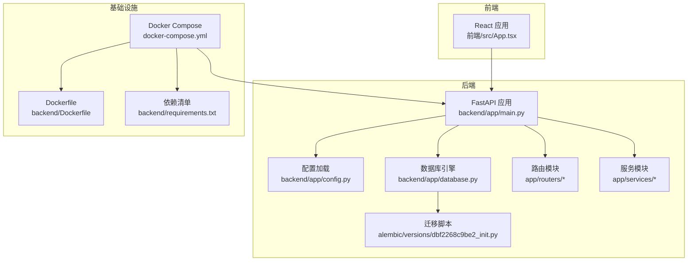
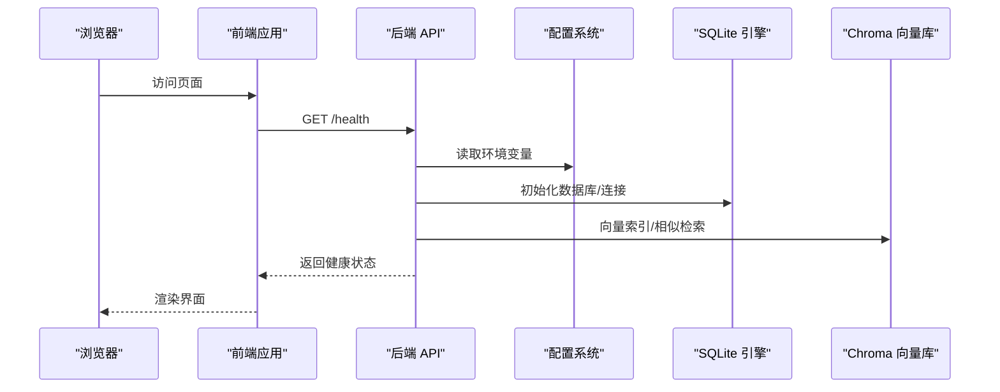
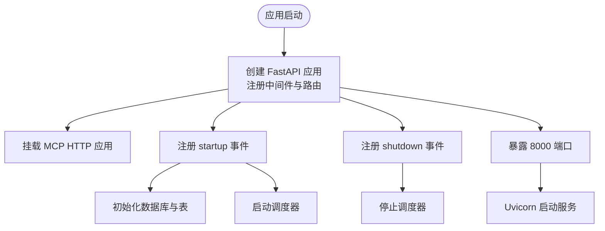
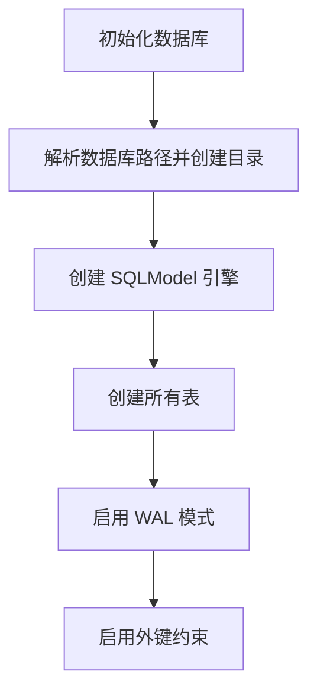
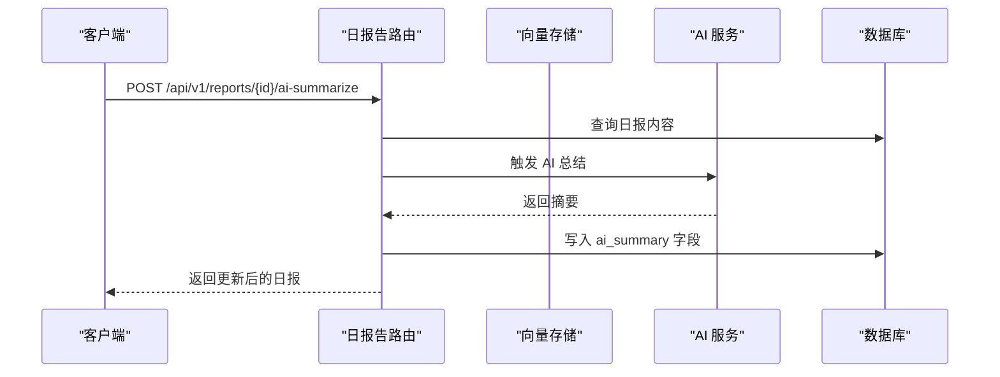
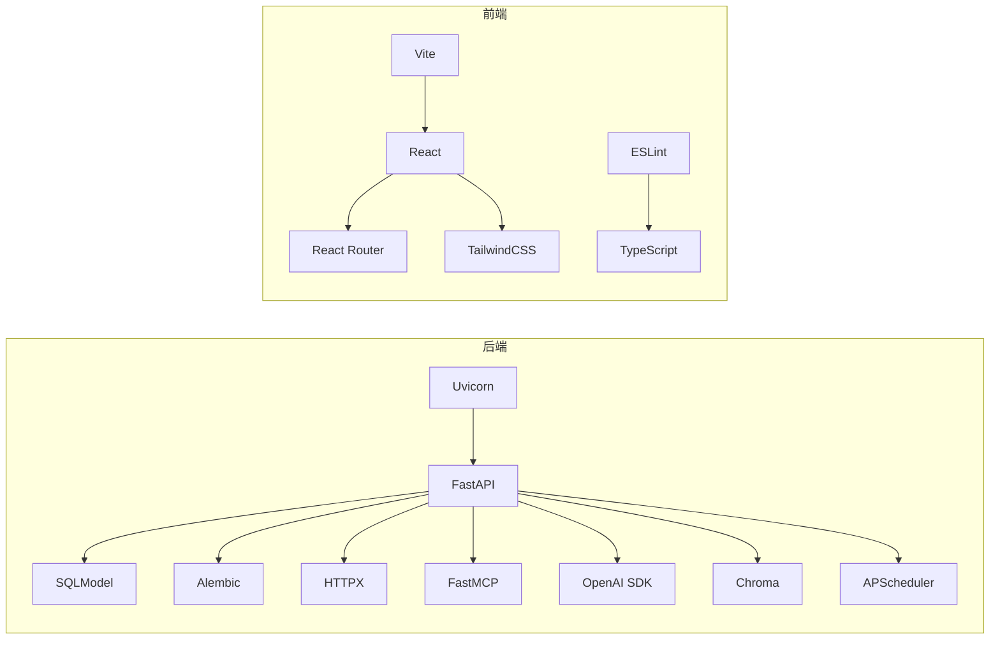

# 快速开始

<cite>
**本文引用的文件**
- [docker-compose.yml](file://docker-compose.yml)
- [backend/Dockerfile](file://backend/Dockerfile)
- [backend/requirements.txt](file://backend/requirements.txt)
- [backend/app/config.py](file://backend/app/config.py)
- [backend/app/main.py](file://backend/app/main.py)
- [backend/app/database.py](file://backend/app/database.py)
- [backend/alembic/versions/dbf2268c9be2_init.py](file://backend/alembic/versions/dbf2268c9be2_init.py)
- [backend/app/routers/daily_reports.py](file://backend/app/routers/daily_reports.py)
- [backend/app/services/ai_agent.py](file://backend/app/services/ai_agent.py)
- [frontend/package.json](file://frontend/package.json)
- [frontend/src/App.tsx](file://frontend/src/App.tsx)
</cite>

## 目录
1. [简介](#简介)
2. [项目结构](#项目结构)
3. [核心组件](#核心组件)
4. [架构总览](#架构总览)
5. [详细组件分析](#详细组件分析)
6. [依赖分析](#依赖分析)
7. [性能考虑](#性能考虑)
8. [故障排除指南](#故障排除指南)
9. [结论](#结论)
10. [附录](#附录)

## 简介
WorkTrack 是一个个人工作管理平台，支持日报、客户与项目、会议纪要管理，并集成了 AI 智能整理与 MCP 服务。本快速开始指南面向初学者，提供从环境准备、安装部署到首次使用的完整流程，涵盖 Docker 与本地开发两种部署方式，以及常见问题排查。

## 项目结构
项目采用前后端分离架构：
- 后端：Python FastAPI 应用，提供 REST API、数据库初始化、定时任务与向量检索；通过 Alembic 进行数据库迁移。
- 前端：React + TypeScript + Vite 构建的单页应用，提供页面导航与基础设置入口。
- 部署：Docker Compose 编排后端服务，挂载数据卷与环境变量，暴露 8000 端口。

图表来源
- [docker-compose.yml:1-19](file://docker-compose.yml#L1-L19)
- [backend/Dockerfile:1-18](file://backend/Dockerfile#L1-L18)
- [backend/requirements.txt:1-12](file://backend/requirements.txt#L1-L12)
- [backend/app/main.py:1-61](file://backend/app/main.py#L1-L61)
- [backend/app/config.py:1-34](file://backend/app/config.py#L1-L34)
- [backend/app/database.py:1-38](file://backend/app/database.py#L1-L38)
- [backend/alembic/versions/dbf2268c9be2_init.py:1-96](file://backend/alembic/versions/dbf2268c9be2_init.py#L1-L96)

章节来源
- [docker-compose.yml:1-19](file://docker-compose.yml#L1-L19)
- [backend/Dockerfile:1-18](file://backend/Dockerfile#L1-L18)
- [backend/requirements.txt:1-12](file://backend/requirements.txt#L1-L12)
- [backend/app/main.py:1-61](file://backend/app/main.py#L1-L61)
- [backend/app/config.py:1-34](file://backend/app/config.py#L1-L34)
- [backend/app/database.py:1-38](file://backend/app/database.py#L1-L38)
- [backend/alembic/versions/dbf2268c9be2_init.py:1-96](file://backend/alembic/versions/dbf2268c9be2_init.py#L1-L96)

## 核心组件
- 配置系统：通过 pydantic-settings 从 .env 加载 LLM、Embedding、Chroma、数据库等配置，并提供回退逻辑。
- 数据库：SQLModel + SQLAlchemy 引擎，SQLite 默认存储，启动时创建表并启用 WAL 与外键。
- API 路由：包含日报、客户、项目、会议、定时任务、AI 代理与搜索等路由。
- AI 与向量：提供日报向量化索引、相似度检索、AI 总结与基于工具的智能代理。
- 前端界面：基础导航与页面占位，展示 API 健康状态与设置入口。

章节来源
- [backend/app/config.py:1-34](file://backend/app/config.py#L1-L34)
- [backend/app/database.py:1-38](file://backend/app/database.py#L1-L38)
- [backend/app/main.py:1-61](file://backend/app/main.py#L1-L61)
- [backend/app/routers/daily_reports.py:1-92](file://backend/app/routers/daily_reports.py#L1-L92)
- [backend/app/services/ai_agent.py:1-216](file://backend/app/services/ai_agent.py#L1-L216)
- [frontend/src/App.tsx:1-110](file://frontend/src/App.tsx#L1-L110)

## 架构总览
下图展示了容器化部署下的系统交互：浏览器访问前端，前端通过同主机网络访问后端 API；后端读取 .env 配置，连接 SQLite 并与 Chroma 向量库协作；AI 服务通过 LLM/Embedding 接口完成摘要与检索。

图表来源
- [docker-compose.yml:1-19](file://docker-compose.yml#L1-L19)
- [backend/app/config.py:1-34](file://backend/app/config.py#L1-L34)
- [backend/app/database.py:1-38](file://backend/app/database.py#L1-L38)
- [backend/app/main.py:1-61](file://backend/app/main.py#L1-L61)

## 详细组件分析

### 后端应用与启动流程
- 应用创建：注册 CORS、挂载路由、挂载 MCP 服务、定义根与健康检查接口。
- 启动事件：初始化数据库与调度器；关闭事件：停止调度器。
- 端口与入口：容器内暴露 8000 端口，通过 Uvicorn 运行。

图表来源
- [backend/app/main.py:1-61](file://backend/app/main.py#L1-L61)

章节来源
- [backend/app/main.py:1-61](file://backend/app/main.py#L1-L61)

### 数据库与迁移
- 目录与连接：根据数据库 URL 自动创建数据目录，SQLite 连接参数适配。
- 初始化：创建所有表，开启 WAL 模式与外键约束。
- 迁移：初始版本包含用户、日报、客户、项目、会议、定时任务等表结构。

图表来源
- [backend/app/database.py:1-38](file://backend/app/database.py#L1-L38)
- [backend/alembic/versions/dbf2268c9be2_init.py:1-96](file://backend/alembic/versions/dbf2268c9be2_init.py#L1-L96)

章节来源
- [backend/app/database.py:1-38](file://backend/app/database.py#L1-L38)
- [backend/alembic/versions/dbf2268c9be2_init.py:1-96](file://backend/alembic/versions/dbf2268c9be2_init.py#L1-L96)

### 配置系统与环境变量
- 配置类：集中定义 LLM、Embedding、Chroma、数据库等配置项。
- 回退策略：Embedding 基础地址与密钥可回退到 LLM 配置。
- 环境文件：默认从项目根目录 .env 加载，编码为 UTF-8。

章节来源
- [backend/app/config.py:1-34](file://backend/app/config.py#L1-L34)

### API 路由与 AI 能力
- 日报路由：支持列表、创建、更新、删除与手动 AI 总结。
- AI 代理：定义工具集合（检索、客户摘要、定时任务、今日日报汇总），支持多轮工具调用与历史上下文。

图表来源
- [backend/app/routers/daily_reports.py:1-92](file://backend/app/routers/daily_reports.py#L1-L92)
- [backend/app/services/ai_agent.py:1-216](file://backend/app/services/ai_agent.py#L1-L216)

章节来源
- [backend/app/routers/daily_reports.py:1-92](file://backend/app/routers/daily_reports.py#L1-L92)
- [backend/app/services/ai_agent.py:1-216](file://backend/app/services/ai_agent.py#L1-L216)

### 前端应用与页面
- 导航：提供“日报”“客户”“会议”“AI 中心”“设置”等导航项。
- 页面：首页展示 API 健康状态与引导信息；设置页预留配置入口。
- 依赖：React、React Router、TailwindCSS、Vite 等。

章节来源
- [frontend/src/App.tsx:1-110](file://frontend/src/App.tsx#L1-L110)
- [frontend/package.json:1-36](file://frontend/package.json#L1-L36)

## 依赖分析
- 后端依赖：FastAPI、Uvicorn、SQLModel、Alembic、OpenAI SDK、Chroma、APScheduler、FastMCP、HTTPX 等。
- 前端依赖：React、React DOM、React Router、TailwindCSS、Vite、ESLint、TypeScript 等。

图表来源
- [backend/requirements.txt:1-12](file://backend/requirements.txt#L1-L12)
- [frontend/package.json:1-36](file://frontend/package.json#L1-L36)

章节来源
- [backend/requirements.txt:1-12](file://backend/requirements.txt#L1-L12)
- [frontend/package.json:1-36](file://frontend/package.json#L1-L36)

## 性能考虑
- 数据库：SQLite 在小规模场景性能稳定，建议在生产中评估并发写入与备份策略。
- 向量检索：Chroma 作为嵌入向量存储，注意持久化目录与磁盘空间规划。
- AI 调用：合理控制工具调用轮次与消息长度，避免超时与成本过高。
- 容器化：使用只读镜像与最小化依赖，减少镜像体积与启动时间。

## 故障排除指南
- 服务无法访问
  - 检查容器是否正常运行与端口映射是否正确。
  - 确认防火墙与安全组放通 8000 端口。
- 数据库初始化失败
  - 确认数据目录权限与路径存在性。
  - 检查数据库 URL 格式与 SQLite 文件权限。
- AI 服务异常
  - 检查 LLM/Embedding 的基础地址、API Key 与模型名配置。
  - 确认网络可达性与代理设置。
- 向量检索无结果
  - 确认文档已成功索引，集合名称与元数据一致。
  - 检查 Embedding 模型输出维度与向量库兼容性。
- 前端无法连接后端
  - 确认跨域配置允许前端来源访问。
  - 检查后端健康检查接口返回状态。

章节来源
- [docker-compose.yml:1-19](file://docker-compose.yml#L1-L19)
- [backend/app/config.py:1-34](file://backend/app/config.py#L1-L34)
- [backend/app/database.py:1-38](file://backend/app/database.py#L1-L38)
- [backend/app/main.py:1-61](file://backend/app/main.py#L1-L61)

## 结论
通过本指南，您可以在本地或容器环境中快速搭建 WorkTrack，并体验核心功能。建议在正式使用前完善环境变量配置与数据备份策略，并根据团队规模选择更稳健的数据库与 AI 服务方案。

## 附录

### 环境要求
- Python：3.8+（容器内使用 3.11）
- Node.js：用于前端构建与开发（版本由 package.json 指定）
- Docker：用于容器化部署（Compose 版本 3.8）

章节来源
- [backend/Dockerfile:1-18](file://backend/Dockerfile#L1-L18)
- [frontend/package.json:1-36](file://frontend/package.json#L1-L36)
- [docker-compose.yml:1-19](file://docker-compose.yml#L1-L19)

### 安装步骤（Docker 部署）
- 克隆仓库并进入根目录
- 准备 .env 文件（见“环境变量配置”）
- 使用 Compose 构建并启动
  - docker compose up --build
- 访问服务
  - 前端：http://localhost:5173
  - 后端：http://localhost:8000
- 停止与清理
  - docker compose down

章节来源
- [docker-compose.yml:1-19](file://docker-compose.yml#L1-L19)
- [backend/Dockerfile:1-18](file://backend/Dockerfile#L1-L18)

### 安装步骤（本地开发）
- 后端
  - 进入 backend 目录，安装依赖
  - 初始化数据库与迁移
  - 启动后端服务
- 前端
  - 进入 frontend 目录，安装依赖
  - 启动开发服务器
- 访问服务
  - 前端：http://localhost:5173
  - 后端：http://localhost:8000

章节来源
- [backend/requirements.txt:1-12](file://backend/requirements.txt#L1-L12)
- [backend/app/database.py:1-38](file://backend/app/database.py#L1-L38)
- [backend/app/main.py:1-61](file://backend/app/main.py#L1-L61)
- [frontend/package.json:1-36](file://frontend/package.json#L1-L36)

### 环境变量配置
- LLM 基础地址、API Key、模型名
- Embedding 基础地址、API Key、模型名（可回退到 LLM 配置）
- Chroma 持久化目录
- 数据库 URL（默认 SQLite）

章节来源
- [backend/app/config.py:1-34](file://backend/app/config.py#L1-L34)
- [docker-compose.yml:11-18](file://docker-compose.yml#L11-L18)

### 基本使用示例
- 访问首页，确认后端健康状态
- 在“AI 中心”页面体验智能问答与工具调用
- 在“日报”页面新增、编辑、删除与 AI 总结
- 在“设置”页面配置 AI 模型与偏好

章节来源
- [frontend/src/App.tsx:1-110](file://frontend/src/App.tsx#L1-L110)
- [backend/app/routers/daily_reports.py:1-92](file://backend/app/routers/daily_reports.py#L1-L92)
- [backend/app/services/ai_agent.py:1-216](file://backend/app/services/ai_agent.py#L1-L216)