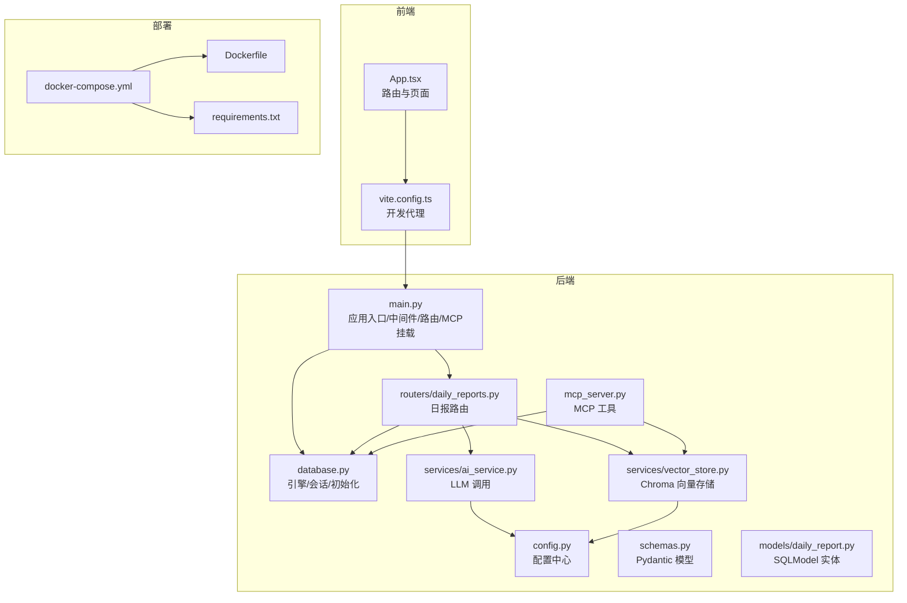
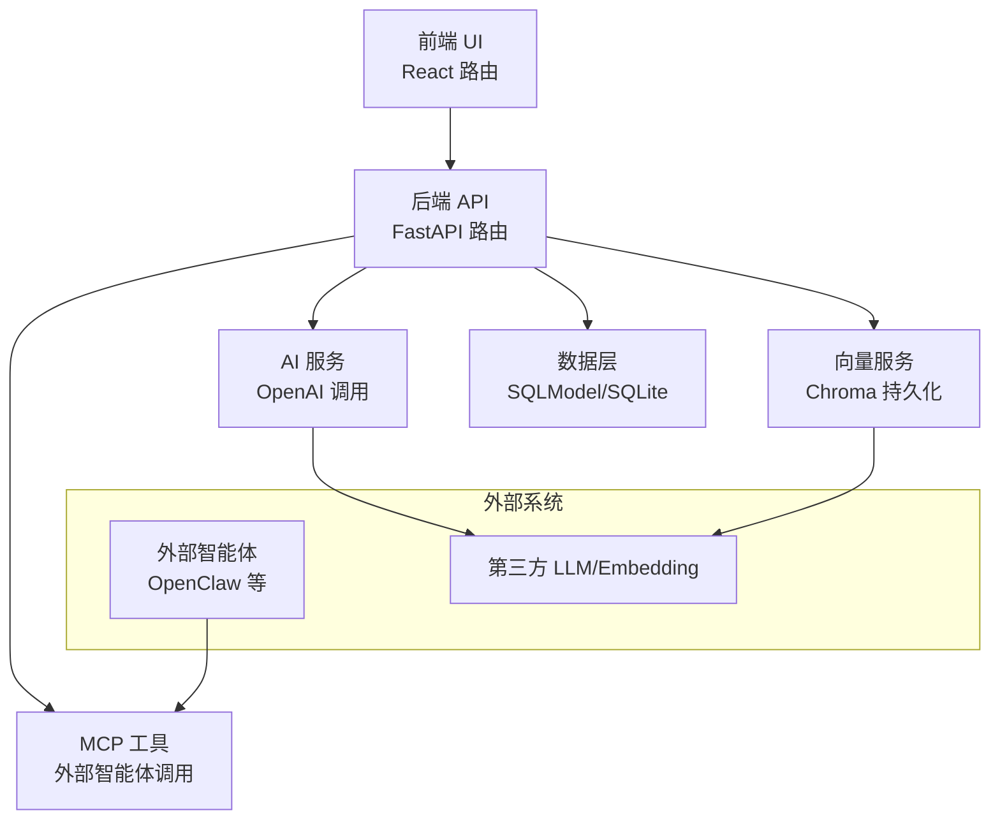
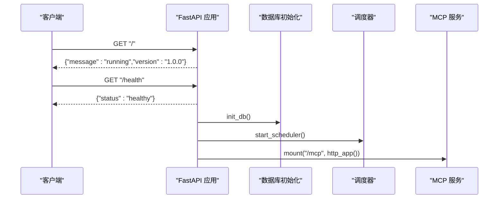
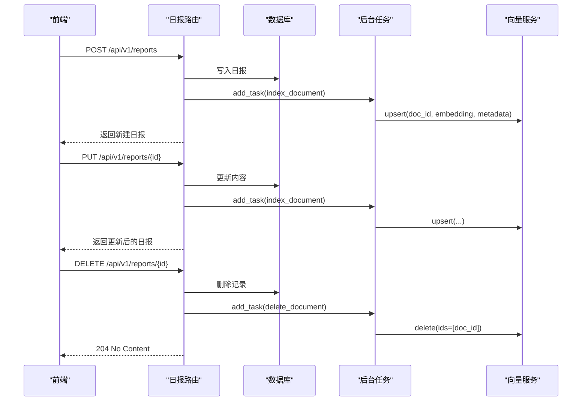
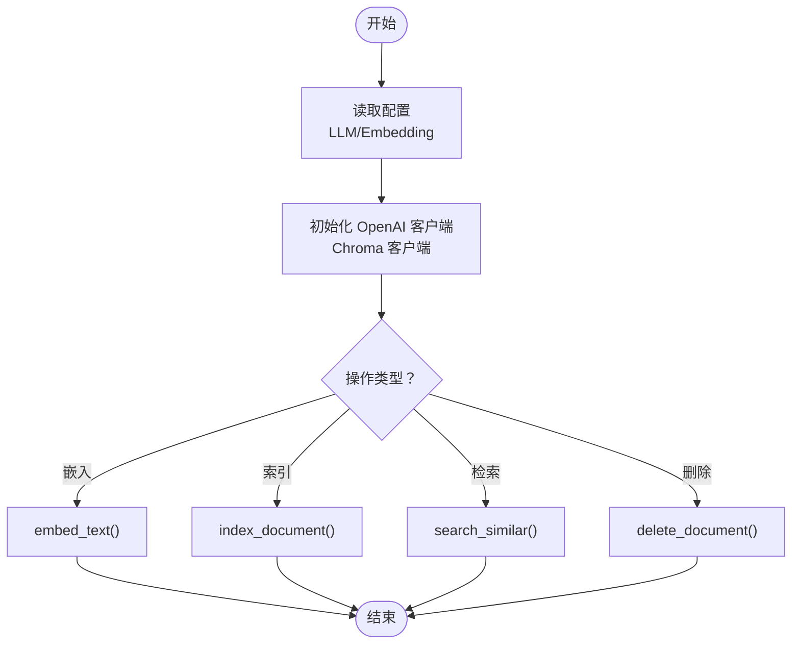
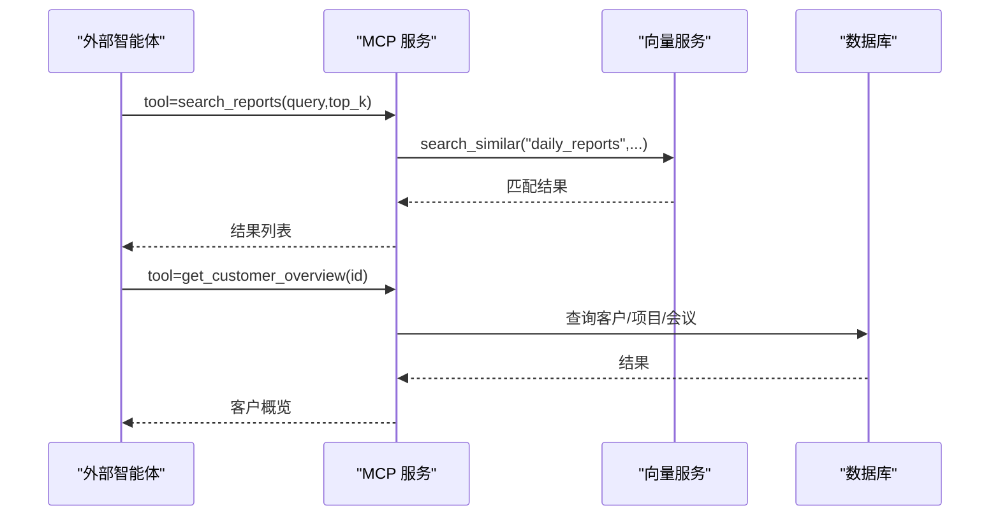
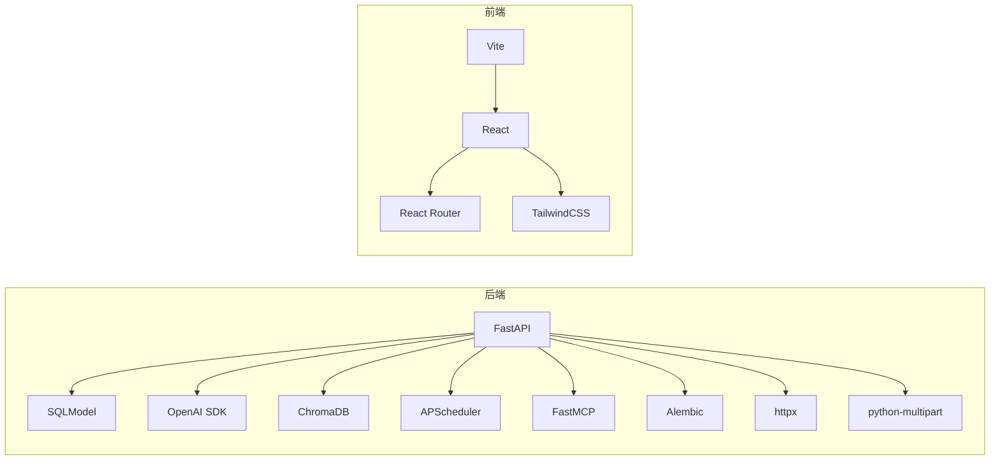

# 系统架构

<cite>
**本文引用的文件**
- [backend/app/main.py](file://backend/app/main.py)
- [backend/app/config.py](file://backend/app/config.py)
- [backend/app/database.py](file://backend/app/database.py)
- [backend/app/routers/daily_reports.py](file://backend/app/routers/daily_reports.py)
- [backend/app/models/daily_report.py](file://backend/app/models/daily_report.py)
- [backend/app/schemas.py](file://backend/app/schemas.py)
- [backend/app/services/ai_service.py](file://backend/app/services/ai_service.py)
- [backend/app/services/vector_store.py](file://backend/app/services/vector_store.py)
- [backend/app/mcp_server.py](file://backend/app/mcp_server.py)
- [docker-compose.yml](file://docker-compose.yml)
- [backend/Dockerfile](file://backend/Dockerfile)
- [backend/requirements.txt](file://backend/requirements.txt)
- [frontend/src/App.tsx](file://frontend/src/App.tsx)
- [frontend/vite.config.ts](file://frontend/vite.config.ts)
- [frontend/package.json](file://frontend/package.json)
</cite>

## 目录
1. [简介](#简介)
2. [项目结构](#项目结构)
3. [核心组件](#核心组件)
4. [架构总览](#架构总览)
5. [详细组件分析](#详细组件分析)
6. [依赖分析](#依赖分析)
7. [性能考量](#性能考量)
8. [故障排查指南](#故障排查指南)
9. [结论](#结论)
10. [附录](#附录)

## 简介
WorkTrack 是一个个人工作管理平台，围绕“日报、客户项目、会议纪要”构建，并集成了 AI 智能整理与 MCP（Model Context Protocol）工具能力。系统采用前后端分离架构，后端基于 FastAPI 提供 REST 与 MCP 服务，前端使用 React + Vite 构建，通过代理访问后端 API；整体通过 Docker Compose 进行本地编排与部署。

## 项目结构
- 后端（Python/FastAPI）
  - 应用入口与中间件、路由注册、启动/关闭事件、健康检查、MCP 挂载
  - 配置中心（环境变量驱动）
  - 数据库与会话注入
  - 路由模块（按领域划分）
  - 服务层（AI、向量检索、调度器）
  - 模型与 Pydantic Schema
  - MCP 服务工具
- 前端（React/Vite）
  - 路由与页面组件
  - 开发服务器代理至后端
- 编排与部署
  - Dockerfile、requirements.txt、docker-compose.yml

图表来源
- [backend/app/main.py:1-61](file://backend/app/main.py#L1-L61)
- [backend/app/config.py:1-34](file://backend/app/config.py#L1-L34)
- [backend/app/database.py:1-38](file://backend/app/database.py#L1-L38)
- [backend/app/routers/daily_reports.py:1-92](file://backend/app/routers/daily_reports.py#L1-L92)
- [backend/app/models/daily_report.py:1-14](file://backend/app/models/daily_report.py#L1-L14)
- [backend/app/schemas.py:1-102](file://backend/app/schemas.py#L1-L102)
- [backend/app/services/ai_service.py:1-106](file://backend/app/services/ai_service.py#L1-L106)
- [backend/app/services/vector_store.py:1-70](file://backend/app/services/vector_store.py#L1-L70)
- [backend/app/mcp_server.py:1-103](file://backend/app/mcp_server.py#L1-L103)
- [docker-compose.yml:1-19](file://docker-compose.yml#L1-L19)
- [backend/Dockerfile:1-18](file://backend/Dockerfile#L1-L18)
- [backend/requirements.txt:1-12](file://backend/requirements.txt#L1-L12)
- [frontend/src/App.tsx:1-110](file://frontend/src/App.tsx#L1-L110)
- [frontend/vite.config.ts:1-13](file://frontend/vite.config.ts#L1-L13)

章节来源
- [backend/app/main.py:1-61](file://backend/app/main.py#L1-L61)
- [docker-compose.yml:1-19](file://docker-compose.yml#L1-L19)
- [backend/Dockerfile:1-18](file://backend/Dockerfile#L1-L18)
- [backend/requirements.txt:1-12](file://backend/requirements.txt#L1-L12)
- [frontend/src/App.tsx:1-110](file://frontend/src/App.tsx#L1-L110)
- [frontend/vite.config.ts:1-13](file://frontend/vite.config.ts#L1-L13)

## 核心组件
- 应用入口与控制流
  - 创建 FastAPI 应用、CORS 中间件、注册各领域路由、启动/关闭事件、挂载 MCP HTTP 应用、根与健康检查接口
- 配置中心
  - 统一读取 LLM/Embedding 基础地址、API Key、模型名、Chroma 持久化目录、数据库 URL，并提供回退策略
- 数据层
  - SQLModel 引擎与会话注入，数据库初始化（建表、WAL、外键），依赖注入函数
- 路由与控制器
  - 日报路由示例：查询、创建、更新、删除、手动 AI 总结；使用后台任务异步更新向量索引
- 服务层
  - AI 服务：OpenAI 客户端封装，日报总结、会议纪要结构化解析、项目分析、通用对话
  - 向量服务：Chroma 持久化客户端，文本嵌入、文档索引、相似度检索、删除
  - MCP 服务：对外暴露工具（日报搜索、客户概览、创建日报、今日日报列表）
- 前端
  - React 路由与页面组件，Vite 开发代理指向后端 8000 端口

章节来源
- [backend/app/main.py:1-61](file://backend/app/main.py#L1-L61)
- [backend/app/config.py:1-34](file://backend/app/config.py#L1-L34)
- [backend/app/database.py:1-38](file://backend/app/database.py#L1-L38)
- [backend/app/routers/daily_reports.py:1-92](file://backend/app/routers/daily_reports.py#L1-L92)
- [backend/app/services/ai_service.py:1-106](file://backend/app/services/ai_service.py#L1-L106)
- [backend/app/services/vector_store.py:1-70](file://backend/app/services/vector_store.py#L1-L70)
- [backend/app/mcp_server.py:1-103](file://backend/app/mcp_server.py#L1-L103)
- [frontend/src/App.tsx:1-110](file://frontend/src/App.tsx#L1-L110)
- [frontend/vite.config.ts:1-13](file://frontend/vite.config.ts#L1-L13)

## 架构总览
- 分层与职责
  - 表现层（前端）：路由、页面、UI 组件，开发时通过代理访问后端
  - 控制层（后端）：FastAPI 路由与控制器，处理请求、调用服务、返回响应
  - 业务层（后端）：AI 服务、向量检索、MCP 工具
  - 数据访问层（后端）：SQLModel/SQLAlchemy 引擎、会话注入、数据库初始化
- 集成模式
  - REST API：统一前缀与标签组织资源
  - MCP：作为独立 HTTP 应用挂载于 /mcp，供外部智能体调用
  - 向量检索：异步后台任务更新/删除索引，避免阻塞主请求
- 技术决策与权衡
  - 使用 FastAPI + Uvicorn：高性能 ASGI 服务器，类型安全与自动生成 OpenAPI 文档
  - SQLModel：ORM 与 Pydantic 的结合，简化模型定义与序列化
  - Chroma + OpenAI Embedding：轻量级本地向量存储，便于单机部署与演示
  - MCP：将内部工具暴露为外部可用的工具集，增强可扩展性与生态集成
- 系统边界
  - 内部：后端应用、数据库、向量存储
  - 外部：前端浏览器、外部智能体（如 OpenClaw）、第三方 LLM/Embedding 服务

图表来源
- [backend/app/main.py:1-61](file://backend/app/main.py#L1-L61)
- [backend/app/services/ai_service.py:1-106](file://backend/app/services/ai_service.py#L1-L106)
- [backend/app/services/vector_store.py:1-70](file://backend/app/services/vector_store.py#L1-L70)
- [backend/app/mcp_server.py:1-103](file://backend/app/mcp_server.py#L1-L103)

## 详细组件分析

### 组件 A：应用入口与控制流（FastAPI）
- 职责
  - 创建应用实例、配置 CORS、注册路由、启动/关闭事件、挂载 MCP、健康检查
- 关键流程
  - 启动事件：初始化数据库、启动调度器
  - 关闭事件：停止调度器
  - 根路径与健康检查：对外展示服务状态
- 依赖关系
  - 路由模块、数据库初始化、MCP 服务

图表来源
- [backend/app/main.py:1-61](file://backend/app/main.py#L1-L61)

章节来源
- [backend/app/main.py:1-61](file://backend/app/main.py#L1-L61)

### 组件 B：配置中心（Settings）
- 职责
  - 从 .env 读取 LLM/Embedding 基础地址、API Key、模型名、Chroma 持久化目录、数据库 URL
  - 提供回退策略：Embedding 未配置时复用 LLM 配置
- 影响范围
  - AI 服务与向量服务均依赖该配置进行初始化

章节来源
- [backend/app/config.py:1-34](file://backend/app/config.py#L1-L34)

### 组件 C：数据层（SQLModel/Session）
- 职责
  - 创建引擎、确保数据目录存在、初始化数据库（建表、WAL、外键）
  - 提供会话注入函数，用于路由依赖
- 复杂度与性能
  - 初始化 O(n) 建表，连接参数适配 SQLite 单线程场景
  - 会话按需创建，避免全局状态

章节来源
- [backend/app/database.py:1-38](file://backend/app/database.py#L1-L38)

### 组件 D：路由与控制器（以日报为例）
- 职责
  - 提供 CRUD 接口与手动 AI 总结接口
  - 使用后台任务异步更新/删除向量索引，保证响应速度
- 数据流
  - 请求进入路由 -> 校验/组装数据 -> 写入数据库 -> 触发后台任务 -> 返回响应
- 错误处理
  - 404 未找到资源时抛出异常

图表来源
- [backend/app/routers/daily_reports.py:1-92](file://backend/app/routers/daily_reports.py#L1-L92)
- [backend/app/services/vector_store.py:1-70](file://backend/app/services/vector_store.py#L1-L70)

章节来源
- [backend/app/routers/daily_reports.py:1-92](file://backend/app/routers/daily_reports.py#L1-L92)
- [backend/app/models/daily_report.py:1-14](file://backend/app/models/daily_report.py#L1-L14)
- [backend/app/schemas.py:1-102](file://backend/app/schemas.py#L1-L102)

### 组件 E：AI 服务与向量检索
- 职责
  - AI 服务：封装 OpenAI 客户端，提供日报总结、会议结构化解析、项目分析、通用对话
  - 向量服务：初始化 Chroma 持久化客户端，文本嵌入、文档索引、相似度检索、删除
- 复杂度
  - 嵌入与检索为 O(k) 查询，k 为 top_k
- 风险与容错
  - 向量操作捕获异常并打印日志，避免影响主流程

图表来源
- [backend/app/services/ai_service.py:1-106](file://backend/app/services/ai_service.py#L1-L106)
- [backend/app/services/vector_store.py:1-70](file://backend/app/services/vector_store.py#L1-L70)
- [backend/app/config.py:1-34](file://backend/app/config.py#L1-L34)

章节来源
- [backend/app/services/ai_service.py:1-106](file://backend/app/services/ai_service.py#L1-L106)
- [backend/app/services/vector_store.py:1-70](file://backend/app/services/vector_store.py#L1-L70)

### 组件 F：MCP 服务（对外工具）
- 职责
  - 暴露工具：日报搜索、客户概览、创建日报、今日日报列表
  - 通过 FastMCP 框架注册为 MCP 工具，供外部智能体调用
- 集成点
  - 与向量检索、数据库会话耦合，实现语义检索与数据查询

图表来源
- [backend/app/mcp_server.py:1-103](file://backend/app/mcp_server.py#L1-L103)
- [backend/app/services/vector_store.py:1-70](file://backend/app/services/vector_store.py#L1-L70)
- [backend/app/database.py:1-38](file://backend/app/database.py#L1-L38)

章节来源
- [backend/app/mcp_server.py:1-103](file://backend/app/mcp_server.py#L1-L103)

### 组件 G：前端（React/Vite）
- 职责
  - 页面路由与导航、主页展示、设置页占位
  - 开发代理将 /api 前缀转发至后端 8000 端口
- 交互
  - 通过 fetch 或库访问后端 REST API，展示数据与触发操作

章节来源
- [frontend/src/App.tsx:1-110](file://frontend/src/App.tsx#L1-L110)
- [frontend/vite.config.ts:1-13](file://frontend/vite.config.ts#L1-L13)

## 依赖分析
- 后端依赖
  - FastAPI、Uvicorn、SQLModel、Alembic、Pydantic-Settings、OpenAI SDK、ChromaDB、APScheduler、FastMCP、httpx、python-multipart
- 前端依赖
  - React、React Router、TailwindCSS、Lucide React、React Markdown、Vite 插件链
- 运行时
  - Python 3.11 基础镜像，暴露 8000 端口，持久化数据目录映射

图表来源
- [backend/requirements.txt:1-12](file://backend/requirements.txt#L1-L12)
- [frontend/package.json:1-36](file://frontend/package.json#L1-L36)

章节来源
- [backend/requirements.txt:1-12](file://backend/requirements.txt#L1-L12)
- [frontend/package.json:1-36](file://frontend/package.json#L1-L36)

## 性能考量
- 向量检索
  - 使用 Chroma 持久化客户端，嵌入模型与检索为 O(k)；建议合理设置 top_k 与过滤条件
- 异步任务
  - 后台任务更新/删除向量索引，避免阻塞主请求，提升用户体验
- 数据库
  - SQLite 在单机场景下简单可靠；若并发写入较高，建议评估迁移至更健壮的数据库
- LLM 调用
  - 通过配置中心集中管理基础地址与 API Key，便于切换与限流

## 故障排查指南
- 健康检查
  - 访问根路径与健康检查接口确认服务运行状态
- CORS 问题
  - 后端已启用宽松 CORS，若仍跨域失败，检查前端代理与目标地址
- 向量索引失败
  - 向量服务捕获异常并打印日志，检查 Embedding 模型名与基础地址是否正确
- MCP 工具不可用
  - 确认应用已挂载 MCP 并处于运行状态，外部智能体可访问 /mcp 路径
- 数据库初始化
  - 启动时自动建表并开启 WAL 与外键，若异常检查数据库 URL 与权限

章节来源
- [backend/app/main.py:1-61](file://backend/app/main.py#L1-L61)
- [backend/app/services/vector_store.py:1-70](file://backend/app/services/vector_store.py#L1-L70)
- [backend/app/mcp_server.py:1-103](file://backend/app/mcp_server.py#L1-L103)
- [backend/app/database.py:1-38](file://backend/app/database.py#L1-L38)

## 结论
WorkTrack 采用清晰的分层架构与前后端分离设计，借助 FastAPI 的高性能与类型安全、SQLModel 的简洁 ORM、Chroma 的本地向量检索以及 MCP 的工具化扩展，形成一个可演进、可集成的个人工作管理平台。通过 Docker Compose 实现一键部署，适合开发者与个人用户在本地快速上手与扩展。

## 附录
- 部署拓扑
  - 单容器模式：后端容器映射 8000 端口，持久化数据目录，通过 .env 注入配置
- 基础设施要求
  - CPU/内存：轻量级，适合本地开发与小规模使用
  - 存储：SQLite 与 Chroma 持久化目录，建议预留一定磁盘空间
- 可扩展性考虑
  - 数据库：从 SQLite 迁移至 PostgreSQL/MySQL 以支持更高并发
  - AI：支持多供应商模型切换与缓存策略
  - MCP：扩展更多工具，接入外部系统
- 安全与监控
  - 安全：生产环境建议限制 CORS、启用鉴权、密钥管理与 HTTPS；对敏感日志脱敏
  - 监控：引入指标采集与日志聚合，关注 LLM 调用延迟与错误率
- 技术栈与版本兼容
  - 后端：Python 3.11、FastAPI、SQLModel、OpenAI SDK、ChromaDB、FastMCP、APScheduler
  - 前端：React 19、React Router、TailwindCSS、Vite
  - 编排：Docker、Docker Compose