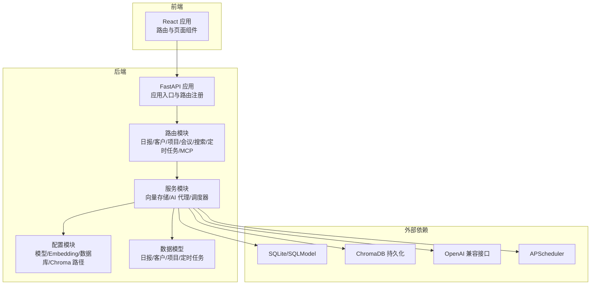
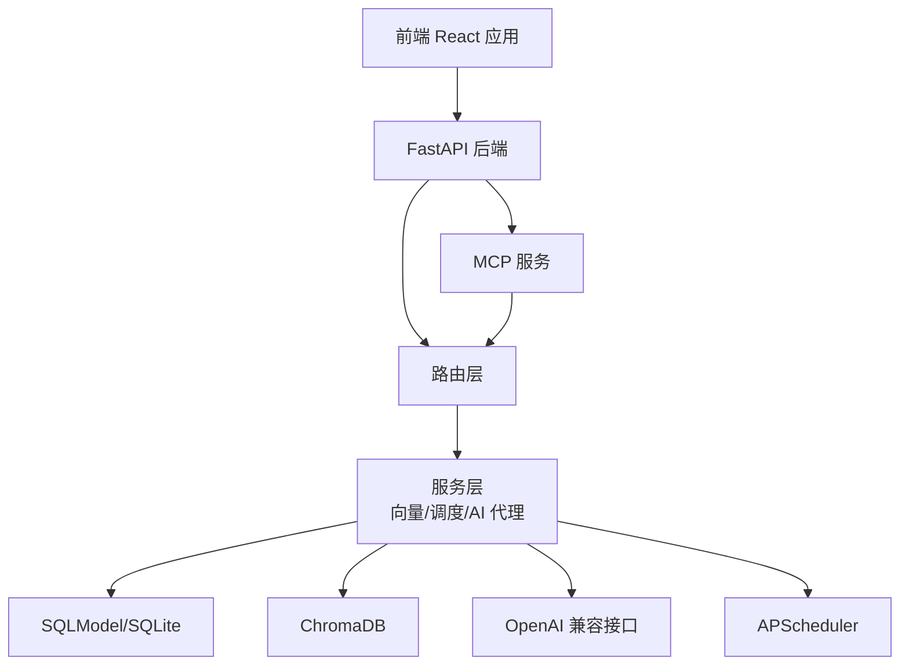
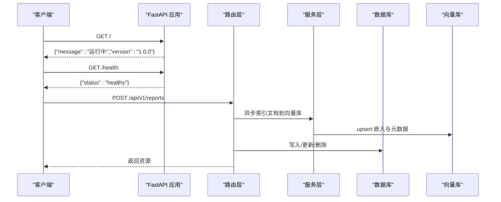
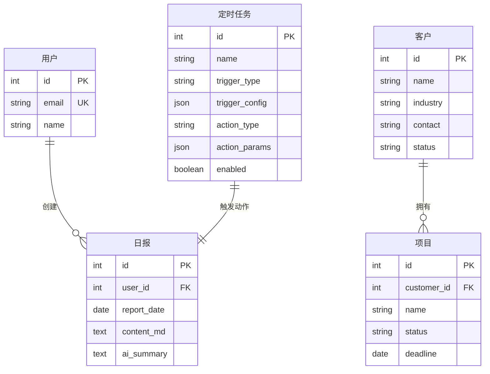
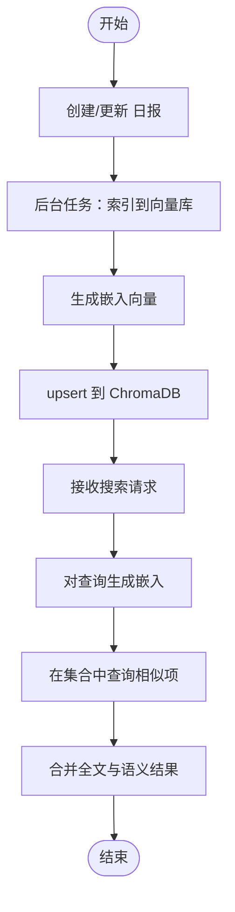
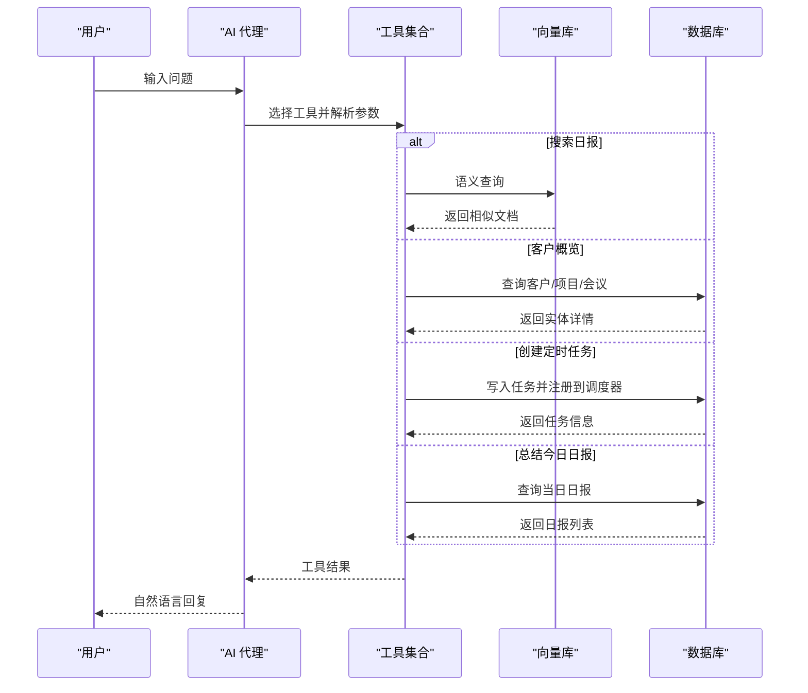
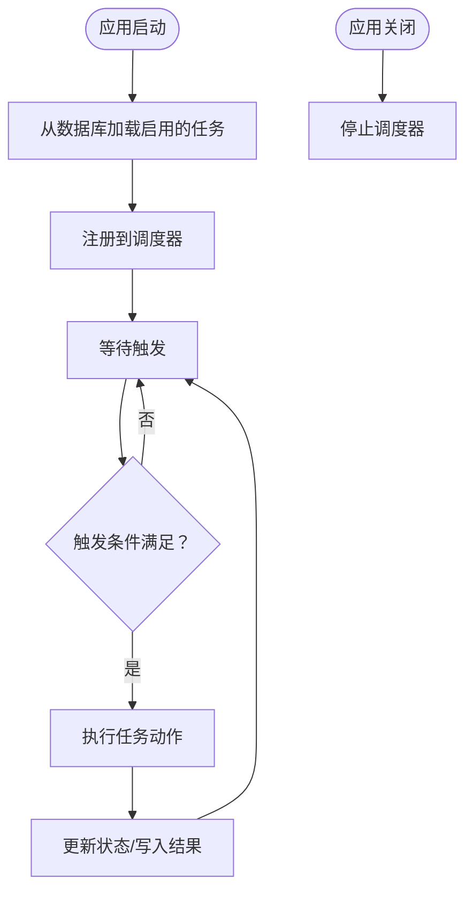
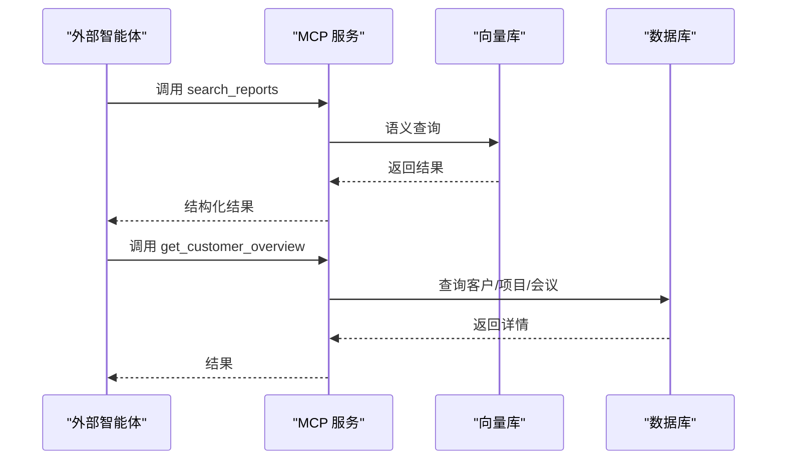
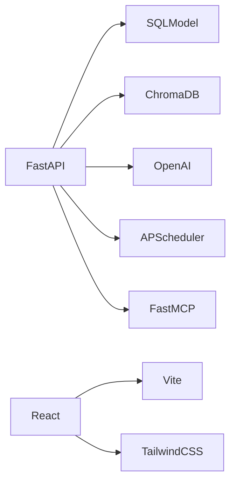

# 项目概述

<cite>
**本文引用的文件**
- [backend/app/main.py](file://backend/app/main.py)
- [backend/app/config.py](file://backend/app/config.py)
- [backend/app/models/daily_report.py](file://backend/app/models/daily_report.py)
- [backend/app/models/customer.py](file://backend/app/models/customer.py)
- [backend/app/models/project.py](file://backend/app/models/project.py)
- [backend/app/routers/daily_reports.py](file://backend/app/routers/daily_reports.py)
- [backend/app/routers/search.py](file://backend/app/routers/search.py)
- [backend/app/services/vector_store.py](file://backend/app/services/vector_store.py)
- [backend/app/services/ai_agent.py](file://backend/app/services/ai_agent.py)
- [backend/app/services/scheduler.py](file://backend/app/services/scheduler.py)
- [backend/app/mcp_server.py](file://backend/app/mcp_server.py)
- [docker-compose.yml](file://docker-compose.yml)
- [backend/requirements.txt](file://backend/requirements.txt)
- [frontend/src/App.tsx](file://frontend/src/App.tsx)
- [frontend/package.json](file://frontend/package.json)
</cite>

## 目录
1. [简介](#简介)
2. [项目结构](#项目结构)
3. [核心组件](#核心组件)
4. [架构总览](#架构总览)
5. [详细组件分析](#详细组件分析)
6. [依赖分析](#依赖分析)
7. [性能考虑](#性能考虑)
8. [故障排除指南](#故障排除指南)
9. [结论](#结论)
10. [附录](#附录)

## 简介
WorkTrack 是一个面向个人的工作管理平台，旨在帮助用户高效记录与管理日常工作，包括“日报”“客户与项目”“会议纪要”等核心场景，并通过 AI 智能化处理与向量检索实现“知识沉淀、智能问答、自动化提醒”。平台采用前后端分离架构：后端基于 FastAPI 提供 REST/MCP 接口与定时任务；前端基于 React + Vite 构建交互界面；数据层以 SQLite + SQLModel 为主，结合 ChromaDB 实现语义向量检索；AI 能力通过 OpenAI 兼容接口对接多种大模型。

本项目解决的核心问题：
- 个人工作管理：结构化记录与检索日报、客户、项目、会议。
- AI 智能化处理：自动摘要、项目分析、智能问答与自动化任务。
- 向量搜索：基于 Embedding 的语义检索，提升跨文档关联发现能力。
- 开放集成：通过 MCP 协议对外暴露工具，便于第三方智能体接入。

## 项目结构
项目采用“后端/前端/容器编排”的分层组织方式：
- 后端（Python/FastAPI）：路由、服务、模型、配置、MCP 服务、调度器。
- 前端（TypeScript/React/Vite）：页面组件、路由、UI 样式与交互。
- 容器编排（Docker Compose）：统一打包与部署，挂载持久化数据与环境变量。

图表来源
- [backend/app/main.py:1-61](file://backend/app/main.py#L1-L61)
- [backend/app/routers/daily_reports.py:1-92](file://backend/app/routers/daily_reports.py#L1-L92)
- [backend/app/services/vector_store.py:1-70](file://backend/app/services/vector_store.py#L1-L70)
- [backend/app/services/ai_agent.py:1-216](file://backend/app/services/ai_agent.py#L1-L216)
- [backend/app/services/scheduler.py:1-121](file://backend/app/services/scheduler.py#L1-L121)
- [backend/app/config.py:1-34](file://backend/app/config.py#L1-L34)
- [frontend/src/App.tsx:1-110](file://frontend/src/App.tsx#L1-L110)

章节来源
- [backend/app/main.py:1-61](file://backend/app/main.py#L1-L61)
- [docker-compose.yml:1-19](file://docker-compose.yml#L1-L19)
- [frontend/src/App.tsx:1-110](file://frontend/src/App.tsx#L1-L110)

## 核心组件
- 应用入口与路由注册：集中注册各业务路由与中间件，挂载 MCP 服务，提供健康检查与根路径响应。
- 数据模型：定义日报、客户、项目等实体及其字段约束。
- 路由层：提供 CRUD 与搜索接口，后台异步索引/更新/删除向量索引。
- 向量存储服务：封装 Embedding 生成与 ChromaDB 操作，提供索引、查询、删除。
- AI 代理与工具：定义工具集（搜索日报、客户概览、创建定时任务、总结今日日报），支持多轮工具调用。
- 定时任务服务：基于 APScheduler 的持久化调度器，支持 cron/interval/date 触发器。
- 配置中心：统一管理 LLM/Embedding 基础地址、API Key、模型名、Chroma 持久化目录与数据库连接。
- 前端应用：提供日报、客户、会议、AI 中心等页面，内置导航与快速操作面板。

章节来源
- [backend/app/main.py:1-61](file://backend/app/main.py#L1-L61)
- [backend/app/models/daily_report.py:1-14](file://backend/app/models/daily_report.py#L1-L14)
- [backend/app/models/customer.py:1-13](file://backend/app/models/customer.py#L1-L13)
- [backend/app/models/project.py:1-13](file://backend/app/models/project.py#L1-L13)
- [backend/app/routers/daily_reports.py:1-92](file://backend/app/routers/daily_reports.py#L1-L92)
- [backend/app/routers/search.py:1-64](file://backend/app/routers/search.py#L1-L64)
- [backend/app/services/vector_store.py:1-70](file://backend/app/services/vector_store.py#L1-L70)
- [backend/app/services/ai_agent.py:1-216](file://backend/app/services/ai_agent.py#L1-L216)
- [backend/app/services/scheduler.py:1-121](file://backend/app/services/scheduler.py#L1-L121)
- [backend/app/config.py:1-34](file://backend/app/config.py#L1-L34)
- [frontend/src/App.tsx:1-110](file://frontend/src/App.tsx#L1-L110)

## 架构总览
下图展示了 WorkTrack 的端到端架构：前端通过 HTTP 访问后端 API；后端路由调用服务层；服务层负责数据库读写、向量索引与 AI 调用；ChromaDB 存储向量；APScheduler 管理定时任务；MCP 服务对外暴露工具给第三方智能体。

图表来源
- [backend/app/main.py:1-61](file://backend/app/main.py#L1-L61)
- [backend/app/routers/daily_reports.py:1-92](file://backend/app/routers/daily_reports.py#L1-L92)
- [backend/app/services/vector_store.py:1-70](file://backend/app/services/vector_store.py#L1-L70)
- [backend/app/services/ai_agent.py:1-216](file://backend/app/services/ai_agent.py#L1-L216)
- [backend/app/services/scheduler.py:1-121](file://backend/app/services/scheduler.py#L1-L121)
- [backend/app/mcp_server.py:1-103](file://backend/app/mcp_server.py#L1-L103)

## 详细组件分析

### 应用入口与控制流
- 应用创建：注册 CORS、业务路由、MCP 服务挂载、启动/关闭事件。
- 启动流程：初始化数据库与调度器；关闭时优雅停止调度器。
- 健康检查：提供根路径与健康检查接口。

图表来源
- [backend/app/main.py:1-61](file://backend/app/main.py#L1-L61)
- [backend/app/routers/daily_reports.py:1-92](file://backend/app/routers/daily_reports.py#L1-L92)
- [backend/app/services/vector_store.py:1-70](file://backend/app/services/vector_store.py#L1-L70)

章节来源
- [backend/app/main.py:1-61](file://backend/app/main.py#L1-L61)

### 数据模型与关系

图表来源
- [backend/app/models/customer.py:1-13](file://backend/app/models/customer.py#L1-L13)
- [backend/app/models/project.py:1-13](file://backend/app/models/project.py#L1-L13)
- [backend/app/models/daily_report.py:1-14](file://backend/app/models/daily_report.py#L1-L14)

章节来源
- [backend/app/models/customer.py:1-13](file://backend/app/models/customer.py#L1-L13)
- [backend/app/models/project.py:1-13](file://backend/app/models/project.py#L1-L13)
- [backend/app/models/daily_report.py:1-14](file://backend/app/models/daily_report.py#L1-L14)

### 向量检索与搜索流程
- 文档索引：创建/更新日报时，后台任务将内容转为向量并写入 ChromaDB，同时保存元数据。
- 语义搜索：对查询词生成嵌入，在指定集合内检索相似文档。
- 混合搜索：同时支持全文检索与语义检索，返回综合结果。

图表来源
- [backend/app/routers/daily_reports.py:1-92](file://backend/app/routers/daily_reports.py#L1-L92)
- [backend/app/services/vector_store.py:1-70](file://backend/app/services/vector_store.py#L1-L70)
- [backend/app/routers/search.py:1-64](file://backend/app/routers/search.py#L1-L64)

章节来源
- [backend/app/routers/daily_reports.py:1-92](file://backend/app/routers/daily_reports.py#L1-L92)
- [backend/app/services/vector_store.py:1-70](file://backend/app/services/vector_store.py#L1-L70)
- [backend/app/routers/search.py:1-64](file://backend/app/routers/search.py#L1-L64)

### AI 代理与工具调用
- 工具定义：搜索日报、客户概览、创建定时任务、总结今日日报。
- 多轮对话：根据 LLM 返回的工具调用，循环执行工具并将结果回传给模型，直到得到自然语言回复。
- 限制与兜底：最多 5 轮工具调用，超限提示简化问题。

图表来源
- [backend/app/services/ai_agent.py:1-216](file://backend/app/services/ai_agent.py#L1-L216)
- [backend/app/services/vector_store.py:1-70](file://backend/app/services/vector_store.py#L1-L70)
- [backend/app/services/scheduler.py:1-121](file://backend/app/services/scheduler.py#L1-L121)

章节来源
- [backend/app/services/ai_agent.py:1-216](file://backend/app/services/ai_agent.py#L1-L216)

### 定时任务与自动化
- 触发器类型：cron、interval、date。
- 动作类型：AI 总结今日日报、AI 分析项目。
- 生命周期：启动时加载并注册任务，关闭时优雅停机；支持动态增删改。

图表来源
- [backend/app/services/scheduler.py:1-121](file://backend/app/services/scheduler.py#L1-L121)

章节来源
- [backend/app/services/scheduler.py:1-121](file://backend/app/services/scheduler.py#L1-L121)

### MCP 服务与外部集成
- 工具暴露：search_reports、get_customer_overview、create_daily_report、list_today_reports。
- 协议：基于 FastMCP，兼容 Model Context Protocol，便于第三方智能体直接调用。

图表来源
- [backend/app/mcp_server.py:1-103](file://backend/app/mcp_server.py#L1-L103)
- [backend/app/services/vector_store.py:1-70](file://backend/app/services/vector_store.py#L1-L70)

章节来源
- [backend/app/mcp_server.py:1-103](file://backend/app/mcp_server.py#L1-L103)

## 依赖分析
- 技术栈选择理由
  - FastAPI：高性能异步框架，自动生成 OpenAPI 文档，适合构建 REST/MCP 服务。
  - SQLModel：基于 Pydantic 的 SQL 数据模型，兼顾 ORM 与数据校验。
  - ChromaDB：轻量级向量数据库，支持持久化与语义检索，适配中小规模知识库。
  - OpenAI：统一的 Embedding 与 LLM 接口，便于切换不同供应商或本地模型。
  - APScheduler：成熟的 Python 调度库，支持持久化与多种触发器。
  - React + Vite：现代前端开发体验，组件化与热更新友好。
- 外部依赖与版本约束见后端依赖清单。

图表来源
- [backend/requirements.txt:1-12](file://backend/requirements.txt#L1-L12)
- [frontend/package.json:1-36](file://frontend/package.json#L1-L36)

章节来源
- [backend/requirements.txt:1-12](file://backend/requirements.txt#L1-L12)
- [frontend/package.json:1-36](file://frontend/package.json#L1-L36)

## 性能考虑
- 异步索引：对新增/更新的日报，使用后台任务异步完成向量索引，避免阻塞主请求。
- 向量查询：按需生成嵌入并限制返回条数，降低延迟。
- 缓存与持久化：ChromaDB 持久化目录与 SQLite 数据库存储，减少重启丢失。
- 调度器：使用 SQLAlchemy JobStore 持久化任务，保证重启后任务可恢复。
- 前端渲染：组件化页面与路由懒加载，提升首屏性能。

## 故障排除指南
- 向量索引失败：检查 Embedding 模型配置与网络连通性；确认 ChromaDB 持久化目录权限。
- 语义搜索异常：确认集合存在且已建立索引；检查查询文本长度与编码。
- 定时任务未执行：检查触发器配置与时区；确认数据库中任务状态为启用。
- MCP 工具调用错误：核对工具参数与数据库连接；查看日志输出定位具体异常。
- 健康检查失败：确认后端服务已启动并监听端口；检查 CORS 配置与防火墙。

章节来源
- [backend/app/services/vector_store.py:1-70](file://backend/app/services/vector_store.py#L1-L70)
- [backend/app/services/scheduler.py:1-121](file://backend/app/services/scheduler.py#L1-L121)
- [backend/app/mcp_server.py:1-103](file://backend/app/mcp_server.py#L1-L103)
- [backend/app/main.py:1-61](file://backend/app/main.py#L1-L61)

## 结论
WorkTrack 通过“结构化记录 + AI 智能化 + 向量检索 + 自动化调度”的组合，为个人工作管理提供了完整闭环：既能沉淀知识、提升检索效率，又能借助 AI 降低重复劳动、增强决策质量。其模块化设计与开放协议（MCP）也为后续扩展与生态集成奠定了基础。

## 附录

### 快速开始指南
- 环境准备
  - 准备环境变量文件（示例键位参考配置模块），确保包含 LLM/Embedding 基础地址、API Key、模型名与 Chroma 持久化目录。
- 启动方式
  - 使用容器编排一键启动：后端服务映射至本地 8000 端口，数据卷挂载至 ./backend/data，环境变量从宿主机注入。
- 访问与验证
  - 前端访问：浏览器打开本地前端（开发服务器或构建产物）。
  - 后端验证：访问根路径与健康检查接口确认服务状态。
- 常用功能
  - 新增/编辑/删除 日报，并观察后台异步索引行为。
  - 在 AI 页面发起对话，尝试“搜索日报”“总结今日日报”等工具。
  - 在设置页配置模型与偏好（如可用）。

章节来源
- [docker-compose.yml:1-19](file://docker-compose.yml#L1-L19)
- [backend/app/config.py:1-34](file://backend/app/config.py#L1-L34)
- [backend/app/main.py:1-61](file://backend/app/main.py#L1-L61)
- [frontend/src/App.tsx:1-110](file://frontend/src/App.tsx#L1-L110)