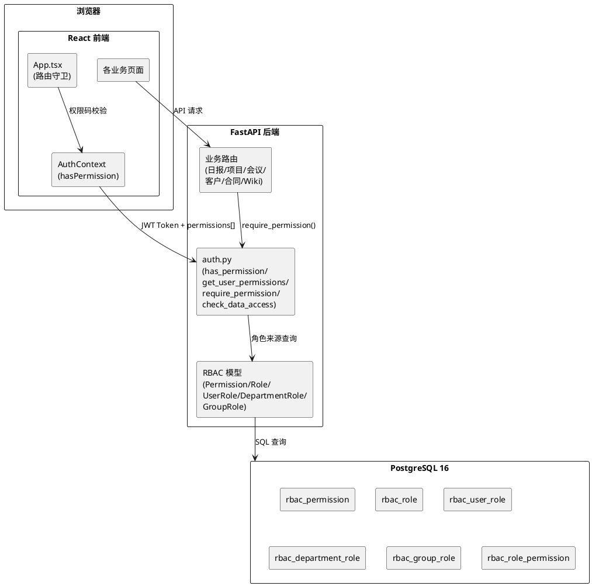
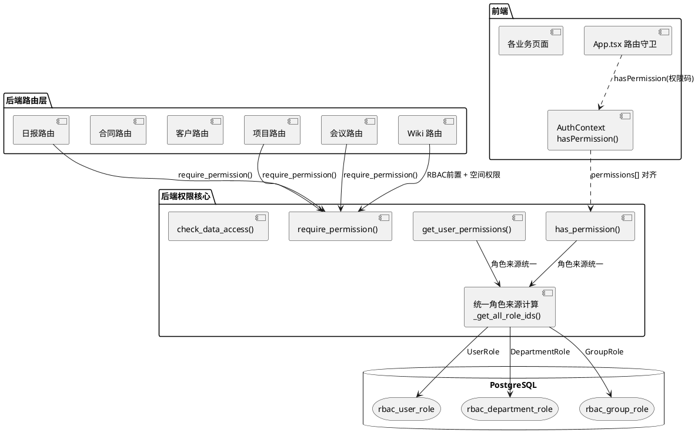
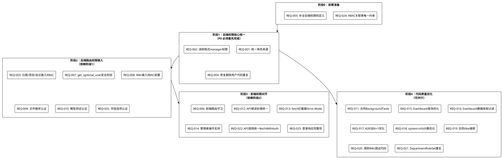

# WorkTrack v2 RBAC 权限系统与代码质量优化 — 实现方案设计

## 文档元数据

| 属性 | 值 |
|------|------|
| 版本 | v1.0 |
| 创建日期 | 2026-05-22 |
| 关联需求规格 | spec.md v1.0 |
| 技术栈 | React 19 + TypeScript + FastAPI + SQLModel + PostgreSQL 16 |

---

# 1. 实现模型

## 1.1 上下文视图

### 系统上下文



### 核心问题：权限三重分裂

当前系统存在三条独立的权限判定路径，导致前后端权限校验结果不一致：

| 路径 | `has_permission()` 使用的角色来源 | `get_user_permissions()` 使用的角色来源 | 一致性 |
|------|------|------|------|
| 1. 管理员 | `user.is_admin` | `user.is_admin` | ✅ 一致 |
| 2. Legacy 字段 | `_LEGACY_PERM_MAP` | 已补充到 permissions | ✅ 一致 |
| 3. RBAC 查询 | `UserRole` + `DepartmentRole` | `UserRole` + `GroupRole` | ❌ **不一致** |

## 1.2 服务/组件总体架构

### 改造后目标架构



### 关键设计决策

1. **统一角色来源**：新增 `_get_all_role_ids(user_id, db)` 函数，合并 UserRole + DepartmentRole + GroupRole 三种角色来源，`has_permission()` 和 `get_user_permissions()` 均调用此函数
2. **消除隐式 manager 权限**：`check_data_access()` 中移除仅凭 `Department.manager_id` 放行的逻辑，必须依赖显式角色分配（`boss` 或 `dept_leader`）
3. **模块权限接入**：日报/项目/会议路由的每个接口添加 `require_permission()` 依赖注入
4. **Wiki RBAC 前置**：Wiki 路由在空间/页面级权限检查之前，先校验 RBAC 权限码

## 1.3 实现设计文档

### 1.3.1 阶段一：RBAC 权限核心统一（P0 基础改造）

#### REQ-001：统一 `has_permission()` 与 `get_user_permissions()` 的角色来源

**修改文件**：`backend/app/auth.py`

**实现方案**：

1. 新增统一角色来源计算函数 `_get_all_role_ids()`

```python
def _get_all_role_ids(user_id: int, db: Session) -> list[int]:
    """
    统一获取用户所有有效角色 ID（三种来源合并去重）：
    1. UserRole — 用户直接分配的角色
    2. DepartmentRole — 用户所属部门的角色
    3. GroupRole — 用户所在用户组的角色
    """
    from app.models.rbac import UserRole, DepartmentRole, GroupRole
    from app.models.wiki import UserGroupMember
    from app.models.user import User

    # 1. 用户直接分配的角色
    user_role_ids = list(
        db.exec(select(UserRole.role_id).where(UserRole.user_id == user_id)).all()
    )

    # 2. 用户所属部门的角色
    dept_role_ids = []
    user_dept_id = db.exec(
        select(User.department_id).where(User.id == user_id)
    ).first()
    if user_dept_id:
        dept_role_ids = list(
            db.exec(
                select(DepartmentRole.role_id)
                .where(DepartmentRole.department_id == user_dept_id)
            ).all()
        )

    # 3. 用户所在用户组的角色
    group_role_ids = list(
        db.exec(
            select(GroupRole.role_id)
            .join(UserGroupMember, UserGroupMember.group_id == GroupRole.group_id)
            .where(UserGroupMember.user_id == user_id)
        ).all()
    )

    return list(set(user_role_ids + dept_role_ids + group_role_ids))
```

2. 重构 `_check_rbac()` 函数，调用 `_get_all_role_ids()`

```python
def _check_rbac(user_id: int, permission_code: str, db: Session) -> bool:
    """通过 RBAC 表检查用户权限（统一角色来源：直接角色 + 部门角色 + 用户组角色）"""
    from app.models.rbac import RolePermission, Permission

    all_role_ids = _get_all_role_ids(user_id, db)
    if not all_role_ids:
        return False

    perm = db.exec(
        select(Permission.id).where(Permission.code == permission_code)
    ).first()
    if not perm:
        return False

    count = db.exec(
        select(RolePermission).where(
            RolePermission.role_id.in_(all_role_ids),
            RolePermission.permission_id == perm,
        )
    ).first()

    return count is not None
```

3. 重构 `get_user_permissions()` 函数，调用 `_get_all_role_ids()`

```python
def get_user_permissions(user: User, db: Session) -> list[str]:
    """获取用户所有有效权限 code 列表（统一角色来源）"""
    if user.is_admin:
        from app.models.rbac import Permission
        return list(db.exec(select(Permission.code)).all())

    from app.models.rbac import RolePermission, Permission

    all_role_ids = _get_all_role_ids(user.id, db)
    if not all_role_ids:
        return []

    perm_ids = list(
        db.exec(
            select(RolePermission.permission_id)
            .where(RolePermission.role_id.in_(all_role_ids))
        ).all()
    )
    if not perm_ids:
        return []

    codes = list(
        db.exec(
            select(Permission.code).where(Permission.id.in_(list(set(perm_ids))))
        ).all()
    )

    # 补充 Legacy 字段权限
    for perm_code, checker in _LEGACY_PERM_MAP.items():
        if checker(user) and perm_code not in codes:
            codes.append(perm_code)

    return codes
```

**影响范围**：`backend/app/auth.py` 的 `_check_rbac()` 和 `get_user_permissions()` 两个函数

---

#### REQ-002：消除 `check_data_access()` 中的隐式 manager 权限

**修改文件**：`backend/app/auth.py`

**实现方案**：

移除 `check_data_access()` 中第345-350行的"部门负责人自动权限"逻辑段。改造后的函数仅保留两条显式路径：

```python
def check_data_access(owner_id: int, current_user: User, db: Session) -> bool:
    """
    统一数据行级访问权限校验：
    1. 用户自身数据：完全放行 (owner_id == current_user.id)
    2. 系统超级管理员 (is_admin)：完全放行
    3. boss 角色：公司拥有者，完全放行
    4. dept_leader 角色：按角色约束，仅管理本部门及子部门
    """
    if owner_id == current_user.id:
        return True

    if current_user.is_admin:
        return True

    from app.models.rbac import UserRole, DepartmentRole, Role
    user_roles_ids = list(db.exec(select(UserRole.role_id).where(UserRole.user_id == current_user.id)).all())

    if current_user.department_id:
        dept_role_ids = list(db.exec(
            select(DepartmentRole.role_id).where(DepartmentRole.department_id == current_user.department_id)
        ).all())
    else:
        dept_role_ids = []

    all_role_ids = list(set(user_roles_ids + dept_role_ids))
    roles = list(db.exec(select(Role.code).where(Role.id.in_(all_role_ids))).all()) if all_role_ids else []

    if "boss" in roles:
        return True

    if "dept_leader" in roles:
        managed = _get_managed_dept_tree(current_user.id, db)
        owner_user = db.get(User, owner_id)
        if owner_user:
            if owner_user.department_id is not None and owner_user.department_id in managed:
                return True
            if owner_user.leader_id == current_user.id:
                return True

    # 删除：仅凭 Department.manager_id 的隐式权限放行逻辑
    return False
```

**关键变更**：删除第345-350行代码段（`managed = _get_managed_dept_tree(...)` 到 `return True`），使 `Department.manager_id` 不再成为隐式权限通道。

**影响范围**：`backend/app/auth.py` 的 `check_data_access()` 函数

---

#### REQ-003：日报/项目/会议模块接入 RBAC 权限校验

**修改文件**：
- `backend/app/routers/daily_reports.py`
- `backend/app/routers/projects.py`
- `backend/app/routers/meetings.py`

**实现方案**：

各模块的路由接口添加 `require_permission()` 依赖注入，替换部分 `get_current_user` 依赖。

##### daily_reports.py 改造

```python
# 导入变更
from app.auth import get_current_user, require_permission

# 各接口依赖注入改造
@router.get("/weekly")
def list_weekly_reports(
    current_user: User = Depends(require_permission("report:read")),
    db: Session = Depends(get_session),
):
    ...

@router.get("/grouped")
def list_reports_grouped(
    user_id: Optional[int] = Query(None),
    current_user: User = Depends(require_permission("report:read")),
    db: Session = Depends(get_session),
):
    ...

@router.get("", response_model=list[DailyReportOut])
def list_reports(
    ...
    current_user: User = Depends(require_permission("report:read")),
    db: Session = Depends(get_session),
):
    ...

@router.get("/{report_id}", response_model=DailyReportOut)
def get_report(
    report_id: int,
    current_user: User = Depends(require_permission("report:read")),
    db: Session = Depends(get_session),
):
    ...

@router.post("", response_model=DailyReportOut, status_code=201)
def create_report(
    data: DailyReportCreate,
    background_tasks: BackgroundTasks,
    current_user: User = Depends(require_permission("report:create")),
    db: Session = Depends(get_session),
):
    ...

@router.put("/{report_id}", response_model=DailyReportOut)
def update_report(
    report_id: int,
    data: DailyReportUpdate,
    background_tasks: BackgroundTasks,
    current_user: User = Depends(require_permission("report:edit")),
    db: Session = Depends(get_session),
):
    ...

@router.delete("/{report_id}", status_code=204)
def delete_report(
    report_id: int,
    background_tasks: BackgroundTasks,
    current_user: User = Depends(require_permission("report:delete")),
    db: Session = Depends(get_session),
):
    ...

# 类似地，周报相关接口使用 report:read/report:edit 权限
# 文件上传和语音转写接口使用 report:create 权限
```

##### projects.py 改造

```python
from app.auth import get_current_user, require_permission

@router.get("", response_model=list[ProjectOut])
def list_projects(
    ...
    current_user: User = Depends(require_permission("project:read")),
    db: Session = Depends(get_session),
):
    ...

@router.post("", response_model=ProjectOut, status_code=201)
def create_project(
    data: ProjectCreate,
    background_tasks: BackgroundTasks,
    current_user: User = Depends(require_permission("project:create")),
    db: Session = Depends(get_session),
):
    ...

@router.put("/{project_id}", response_model=ProjectOut)
def update_project(
    project_id: int,
    data: ProjectUpdate,
    background_tasks: BackgroundTasks,
    current_user: User = Depends(require_permission("project:edit")),
    db: Session = Depends(get_session),
):
    ...

@router.delete("/{project_id}", status_code=204)
def delete_project(
    project_id: int,
    background_tasks: BackgroundTasks,
    current_user: User = Depends(require_permission("project:delete")),
    db: Session = Depends(get_session),
):
    ...
```

##### meetings.py 改造

```python
from app.auth import get_current_user, require_permission

@router.get("", response_model=list[MeetingNoteOut])
def list_meetings(
    ...
    current_user: User = Depends(require_permission("meeting:read")),
    db: Session = Depends(get_session),
):
    ...

@router.post("", response_model=MeetingNoteOut, status_code=201)
def create_meeting(
    data: MeetingNoteCreate,
    background_tasks: BackgroundTasks,
    current_user: User = Depends(require_permission("meeting:create")),
    db: Session = Depends(get_session),
):
    ...

@router.put("/{meeting_id}", response_model=MeetingNoteOut)
def update_meeting(
    meeting_id: int,
    data: MeetingNoteUpdate,
    background_tasks: BackgroundTasks,
    current_user: User = Depends(require_permission("meeting:edit")),
    db: Session = Depends(get_session),
):
    ...

@router.delete("/{meeting_id}", status_code=204)
def delete_meeting(
    meeting_id: int,
    background_tasks: BackgroundTasks,
    current_user: User = Depends(require_permission("meeting:delete")),
    db: Session = Depends(get_session),
):
    ...
```

**接口权限码映射表**：

| 模块 | 接口 | 权限码 |
|------|------|--------|
| 日报 | GET /reports/weekly | report:read |
| 日报 | GET /reports/grouped | report:read |
| 日报 | GET /reports | report:read |
| 日报 | GET /reports/{id} | report:read |
| 日报 | POST /reports | report:create |
| 日报 | PUT /reports/{id} | report:edit |
| 日报 | DELETE /reports/{id} | report:delete |
| 日报 | POST /reports/{id}/ai-summarize | report:edit |
| 日报 | POST /reports/upload-file | report:create |
| 日报 | POST /reports/transcribe-audio | report:create |
| 日报 | GET /reports/weekly-summaries | report:read |
| 日报 | POST /reports/weekly-summary | report:create |
| 日报 | PUT /reports/weekly-summary/{week} | report:edit |
| 项目 | GET /projects | project:read |
| 项目 | POST /projects | project:create |
| 项目 | GET /projects/{id} | project:read |
| 项目 | PUT /projects/{id} | project:edit |
| 项目 | DELETE /projects/{id} | project:delete |
| 项目 | POST /projects/{id}/ai-analysis | project:edit |
| 项目 | GET /projects/{id}/meetings | project:read |
| 会议 | GET /meetings | meeting:read |
| 会议 | POST /meetings | meeting:create |
| 会议 | PUT /meetings/{id} | meeting:edit |
| 会议 | DELETE /meetings/{id} | meeting:delete |
| 会议 | POST /meetings/{id}/ai-extract | meeting:edit |
| 会议 | POST /meetings/{id}/upload-audio | meeting:edit |
| 会议 | POST /meetings/{id}/transcribe | meeting:edit |
| 会议 | POST /meetings/{id}/transcribe-and-organize | meeting:edit |

---

#### REQ-004：修复删除用户函数中的代码重复

**修改文件**：`backend/app/routers/users.py`

**实现方案**：

删除第745-786行的重复代码段（第744行 `db.commit()` 之后的全部内容）。保留第668-744行的完整逻辑不变。

**具体操作**：
- 将第744行 `db.commit()` 后的重复代码全部删除
- 仅保留一次完整的关联数据清理 + 一次 `db.delete(user)` + 一次 `db.commit()`

---

#### REQ-005：消除前端"幻觉权限码"

**修改文件**：
- `backend/app/database.py` — 确认权限码定义完整
- `frontend/src/App.tsx` — 移除或替换不存在的权限码

**实现方案**：

1. **后端确认**：`PERMISSION_DEFS` 中已定义 `project:view_all`（第125行），该权限码合法。需确认前端使用的所有权限码均在 `PERMISSION_DEFS` 中有定义。

2. **前端权限码审计**：

| 前端使用位置 | 权限码 | 后端是否定义 | 处理方式 |
|------|------|------|------|
| App.tsx:453 | `customer:read` | ✅ | 保留 |
| App.tsx:487 | `contract:read` | ✅ | 保留 |
| App.tsx:674 | `customer:read` | ✅ | 保留 |
| App.tsx:675 | `contract:read` | ✅ | 保留 |
| ProjectsPage | `project:create` | ✅ | 保留 |
| ProjectsPage | `project:edit` | ✅ | 保留 |
| ProjectsPage | `project:delete` | ✅ | 保留 |
| ProjectsPage | `project:view_all` | ✅ | 保留 |

**需新增的权限码**（后端 `PERMISSION_DEFS` 中缺少）：

| 权限码 | 说明 | 需新增 |
|------|------|------|
| `dashboard:read` | 查看看板 | 是 |
| `task:read` | 查看定时任务 | 是 |
| `log:read` | 查看运行日志 | 是 |

在 `backend/app/database.py` 的 `PERMISSION_DEFS` 列表中追加：

```python
PERMISSION_DEFS = [
    # ... 现有权限 ...
    # 看板
    ("dashboard:read", "查看看板", "dashboard", "read"),
    # 定时任务
    ("task:read", "查看定时任务", "task", "read"),
    ("task:create", "创建定时任务", "task", "create"),
    ("task:edit", "编辑定时任务", "task", "edit"),
    ("task:delete", "删除定时任务", "task", "delete"),
    # 运行日志
    ("log:read", "查看运行日志", "log", "read"),
]
```

同时在 `ROLE_DEFS` 中为相应角色补充新权限码（如 `user` 角色添加 `dashboard:read`）。

---

### 1.3.2 阶段二：前端路由守卫与权限对齐（P1 改造）

#### REQ-006：补全前端路由权限守卫

**修改文件**：`frontend/src/App.tsx`

**实现方案**：

改造 `App.tsx` 中的路由定义，为所有业务页面添加 `hasPermission` 守卫。当前路由定义（第668-684行）改为：

```tsx
<Routes>
  <Route path="/" element={<Navigate to={homePage} replace />} />
  <Route path="/reports" element={hasPermission('report:read') ? <ReportHubPage /> : <Navigate to="/" replace />} />
  <Route path="/projects" element={hasPermission('project:read') ? <ProjectsPage /> : <Navigate to="/" replace />} />
  <Route path="/meetings" element={hasPermission('meeting:read') ? <MeetingsPage /> : <Navigate to="/" replace />} />
  <Route path="/ai" element={hasPermission('ai:use') ? <AIPage /> : <Navigate to="/" replace />} />
  <Route path="/customers" element={hasPermission('customer:read') ? <CustomersPage /> : <Navigate to="/" replace />} />
  <Route path="/contracts" element={hasPermission('contract:read') ? <ContractsPage /> : <Navigate to="/" replace />} />
  <Route path="/tasks" element={hasPermission('task:read') ? <ScheduledTasksPage /> : <Navigate to="/" replace />} />
  <Route path="/logs" element={hasPermission('log:read') ? <LogViewerPage /> : <Navigate to="/" replace />} />
  <Route path="/settings" element={<SettingsPage />} />
  <Route path="/users" element={hasPermission('user:read') ? <UserManagementPage /> : <Navigate to="/" replace />} />
  <Route path="/dashboard" element={hasPermission('dashboard:read') ? <DashboardPage /> : <Navigate to="/" replace />} />
  <Route path="/wiki" element={hasPermission('wiki:read') ? <WikiPage /> : <Navigate to="/" replace />} />
  <Route path="/wiki/:spaceId" element={hasPermission('wiki:read') ? <WikiPage /> : <Navigate to="/" replace />} />
  <Route path="/wiki/public/:spaceId/:pageId" element={<PublicWikiPage />} />
</Routes>
```

**侧边栏导航守卫同步**：

为所有未做权限守卫的导航项添加 `hasPermission` 条件渲染：

```tsx
{hasPermission('ai:use') && <NavLink to="/ai">...</NavLink>}
{hasPermission('wiki:read') && <NavLink to="/wiki">...</NavLink>}
{hasPermission('dashboard:read') && <NavLink to="/dashboard">...</NavLink>}
{hasPermission('report:read') && <NavLink to="/reports">...</NavLink>}
{hasPermission('project:read') && <NavLink to="/projects">...</NavLink>}
{hasPermission('meeting:read') && <NavLink to="/meetings">...</NavLink>}
{hasPermission('task:read') && <NavLink to="/tasks">...</NavLink>}
{hasPermission('user:read') && <NavLink to="/users">...</NavLink>}
```

**设置页面特殊处理**：`/settings` 不做路由守卫（所有登录用户可访问自己的设置），但设置中的敏感操作（如用户管理、系统配置）由页面内守卫控制。

---

#### REQ-007：补全 `get_optional_user()` 的安全校验

**修改文件**：`backend/app/auth.py`

**实现方案**：

在 `get_optional_user()` 函数中添加 `token_version` 和账号状态校验，与 `get_current_user()` 保持一致：

```python
def get_optional_user(
    credentials: Optional[HTTPAuthorizationCredentials] = Depends(security),
    db: Session = Depends(get_session),
) -> Optional[User]:
    """可选的用户解析，未登录返回 None（用于公开接口）"""
    if credentials is None:
        return None
    payload = decode_token(credentials.credentials)
    if payload is None:
        return None
    user_id = payload.get("sub")
    if not user_id:
        return None
    user = db.get(User, int(user_id))
    if not user:
        return None
    # 校验 token_version
    token_tv = payload.get("tv", 0)
    if token_tv != user.token_version:
        return None
    # 校验账号状态
    if user.status in ("resigned", "disabled") or not user.is_active:
        return None
    return user
```

---

#### REQ-008：Wiki 模块接入 RBAC 前置权限

**修改文件**：`backend/app/routers/wiki.py`

**实现方案**：

在 Wiki 路由的每个接口中，先通过 `require_permission()` 校验 RBAC 前置权限码，通过后再执行原有的空间/页面级权限判定。

**权限码映射**：

| 操作类型 | RBAC 前置权限码 | 说明 |
|------|------|------|
| 查看空间/页面 | `wiki:read` | 读取操作的最低权限 |
| 创建空间/页面 | `wiki:create` | 创建操作 |
| 编辑空间/页面 | `wiki:edit` | 编辑操作 |
| 删除空间/页面 | `wiki:delete` | 删除操作 |
| 管理空间权限 | `wiki:manage_space` | 权限管理操作 |

**具体改造**：在每个路由函数中添加 `require_permission` 依赖注入，示例：

```python
from app.auth import get_current_user, require_permission

@router.get("/spaces", response_model=list[WikiSpaceOut])
def list_spaces(
    current_user: User = Depends(require_permission("wiki:read")),
    db: Session = Depends(get_session),
):
    ...  # 原有逻辑不变

@router.post("/spaces", response_model=WikiSpaceOut, status_code=201)
def create_space(
    data: WikiSpaceCreate,
    current_user: User = Depends(require_permission("wiki:create")),
    db: Session = Depends(get_session),
):
    ...  # 原有逻辑不变
```

**公开外链接口特殊处理**：`/public/pages/{page_id}` 和 `/public/spaces/{space_id}/pages` 不受 RBAC 前置权限约束（因为无需认证），保持现有逻辑不变。

---

#### REQ-009：文件服务接口添加认证保护

**修改文件**：
- `backend/app/routers/auth.py` — `serve_avatar()`
- `backend/app/routers/meetings.py` — `serve_audio()`

**实现方案**：

```python
# auth.py
@router.get("/avatar-file/{filename}")
def serve_avatar(
    filename: str,
    current_user: User = Depends(get_current_user),  # 新增认证
):
    filepath = os.path.join(AVATAR_DIR, filename)
    if not os.path.exists(filepath):
        raise HTTPException(status_code=404, detail="头像文件不存在")
    return FileResponse(filepath)

# meetings.py
@router.get("/audio/{filename}")
def serve_audio(
    filename: str,
    current_user: User = Depends(get_current_user),  # 新增认证
):
    from fastapi.responses import FileResponse
    filepath = os.path.join(UPLOAD_DIR, filename)
    if not os.path.exists(filepath):
        raise HTTPException(status_code=404, detail="文件不存在")
    return FileResponse(filepath, media_type="audio/webm")
```

---

#### REQ-010：模型测试接口添加认证保护

**修改文件**：`backend/app/routers/settings.py`

**实现方案**：

为 `test_provider_model()` 和 `test_provider()` 添加 `get_current_user` 依赖注入：

```python
@router.post("/providers/{provider_id}/models/{model_id}/test")
def test_provider_model(
    provider_id: int,
    model_id: int,
    current_user: User = Depends(get_current_user),  # 新增认证
    db: Session = Depends(get_session),
):
    ...

@router.post("/providers/{provider_id}/test")
def test_provider(
    provider_id: int,
    current_user: User = Depends(get_current_user),  # 新增认证
    db: Session = Depends(get_session),
):
    ...
```

---

#### REQ-011：合同后台解析改用 BackgroundTasks

**修改文件**：`backend/app/routers/contracts.py`

**实现方案**：

1. 移除 `threading` 导入，添加 `BackgroundTasks` 参数
2. 改造 `create_contract()` 接口签名，添加 `background_tasks: BackgroundTasks` 参数
3. 改造 `_auto_parse_contract()` 使用依赖注入的 Session（通过闭包捕获 session_id 而非手动创建 Session）

```python
# 移除 threading 导入
# import threading  # 删除

@router.post("", response_model=ContractOut, status_code=201)
async def create_contract(
    ...,
    background_tasks: BackgroundTasks,  # 新增
    current_user: User = Depends(require_permission("contract:create")),
    db: Session = Depends(get_session),
):
    ...
    if file_path and file_type:
        # 使用 BackgroundTasks 替代 threading.Thread
        background_tasks.add_task(_auto_parse_contract_safe, contract.id, current_user.id)
    return contract


def _auto_parse_contract_safe(contract_id: int, user_id: int):
    """BackgroundTasks 安全包装：确保独立 Session 并异常处理"""
    from app.database import engine
    from sqlmodel import Session as SqlSession
    with SqlSession(engine) as db:
        try:
            _auto_parse_contract(contract_id, user_id, db)
            db.commit()
        except Exception as e:
            write_log("error", "contract", f"后台解析合同#{contract_id}失败: {str(e)[:150]}", details=str(e))


def _auto_parse_contract(contract_id: int, user_id: int, db: Session):
    """合同后台解析核心逻辑（使用传入的 db Session）"""
    ...
```

---

#### REQ-012：前端 API 错误处理统一

**修改文件**：`frontend/src/contexts/AuthContext.tsx`

**实现方案**：

在全局 fetch 拦截器中统一处理 401/403 响应：

```typescript
window.fetch = async (input: RequestInfo | URL, init?: RequestInit) => {
    const url = typeof input === 'string' ? input : input instanceof URL ? input.href : input.url
    const currentToken = tokenRef.current

    if (currentToken && (url.startsWith('/api/') || url.includes('/api/'))) {
        const headers = new Headers(init?.headers)
        if (!headers.has('Authorization')) {
            headers.set('Authorization', `Bearer ${currentToken}`)
        }
        const newInit: RequestInit = { ...init, headers }
        const response = await originalFetch.current!(input, newInit)

        // 统一错误处理
        if (response.status === 401) {
            // Token 过期/无效，清除登录状态
            localStorage.removeItem('auth_token')
            setToken(null)
            setUser(null)
            // 跳转到登录页
            window.location.href = '/login'
            return response
        }

        return response
    }
    return originalFetch.current!(input, init)
}
```

---

#### REQ-013：修复全局 fetch 拦截器 Strict Mode 兼容性

**修改文件**：`frontend/src/contexts/AuthContext.tsx`

**实现方案**：

使用模块级变量替代 `useRef` 存储原始 fetch，确保 Strict Mode 下拦截器仅设置一次：

```typescript
// 模块级变量，确保全局唯一
let _originalFetch: typeof fetch | null = null
let _interceptorInstalled = false

export function AuthProvider({ children }: { children: ReactNode }) {
    // ...

    useEffect(() => {
        if (_interceptorInstalled) return  // 防止重复安装

        if (_originalFetch === null) {
            _originalFetch = window.fetch.bind(window)
        }

        _interceptorInstalled = true
        window.fetch = async (input, init) => {
            // ... 拦截逻辑不变
        }

        return () => {
            // 恢复原始 fetch
            if (_originalFetch) {
                window.fetch = _originalFetch
                _interceptorInstalled = false
            }
        }
    }, [])

    // ...
}
```

---

#### REQ-014：前端项目/会议/日报管理者操作支持

**修改文件**：
- `frontend/src/pages/ProjectsPage.tsx`
- `frontend/src/pages/MeetingsPage.tsx`
- `frontend/src/pages/ReportHubPage.tsx`

**实现方案**：

各页面的编辑/删除操作判定逻辑，从 `item.user_id === current_user.id` 改为调用后端 `check_data_access` 接口或在前端基于已有权限码判定：

1. **简化方案**（推荐）：基于权限码判定操作可见性
   - 有 `project:edit` 权限 → 显示编辑按钮
   - 有 `project:delete` 权限 → 显示删除按钮
   - 有 `report:view_all` 权限 → 可查看他人日报

2. **完整方案**：后端在列表接口返回每条数据的 `_can_edit` / `_can_delete` 标记

采用简化方案，将编辑/删除操作的显示条件从 `item.user_id === user.id` 改为 `hasPermission('project:edit')` 或 `hasPermission('project:delete')`。

---

### 1.3.3 阶段三：后端代码质量修复（P2 改造）

#### REQ-015：Dashboard 连续天数查询优化

**修改文件**：`backend/app/routers/dashboard.py`

**实现方案**：

将循环逐日查询改为一次批量查询：

```python
# 替代循环中的逐日查询
# 批量查询近90个工作日的日报
recent_reports = db.exec(
    select(DailyReport.report_date).where(
        DailyReport.user_id == current_user.id,
        DailyReport.report_date >= today - timedelta(days=90),
        DailyReport.report_date <= today,
    )
).all()
report_dates = set(recent_reports)

# 然后用集合查找计算连续天数
streak_days = 0
for delta in range(90):
    d = today - timedelta(days=delta)
    if not is_workday(d):
        continue
    if d in report_dates:
        streak_days += 1
    else:
        break
```

---

#### REQ-016：Dashboard 统计接口数据库层过滤

**修改文件**：`backend/app/routers/dashboard.py`

**实现方案**：

项目/客户统计使用 SQL WHERE 条件过滤日期范围，替代全量加载后 Python 过滤：

```python
# 项目统计 - 数据库层过滤
from sqlalchemy import func as sa_func

projects_in_range = db.exec(
    select(Project).where(
        Project.user_id == current_user.id,
        Project.created_at <= range_end_datetime,
    )
).all()

new_projects_count = db.exec(
    select(sa_func.count(Project.id)).where(
        Project.user_id == current_user.id,
        Project.created_at >= range_start_datetime,
        Project.created_at <= range_end_datetime,
    )
).one()

# 客户统计 - 数据库层过滤
customers_in_range = db.exec(
    select(Customer).where(
        Customer.user_id == current_user.id,
        Customer.created_at <= range_end_datetime,
    )
).all()

new_customers_count = db.exec(
    select(sa_func.count(Customer.id)).where(
        Customer.user_id == current_user.id,
        Customer.created_at >= range_start_datetime,
        Customer.created_at <= range_end_datetime,
    )
).one()
```

---

#### REQ-017：AI 对话列表 N+1 查询优化

**修改文件**：`backend/app/routers/ai_agent.py`

**实现方案**：

使用子查询一次性获取每个对话的消息数量：

```python
from sqlalchemy import func as sa_func

@router.get("/conversations", response_model=list[ConversationOut])
def list_conversations(current_user: User = Depends(get_current_user), db: Session = Depends(get_session)):
    """获取当前用户的对话列表（优化：单次 JOIN 查询）"""
    # 子查询：每个对话的消息数量
    msg_count_subq = (
        select(
            ChatMessage.conversation_id,
            sa_func.count(ChatMessage.id).label("msg_count")
        )
        .group_by(ChatMessage.conversation_id)
        .subquery()
    )

    rows = db.exec(
        select(
            ChatConversation,
            sa_func.coalesce(msg_count_subq.c.msg_count, 0)
        )
        .outerjoin(msg_count_subq, ChatConversation.id == msg_count_subq.c.conversation_id)
        .where(ChatConversation.user_id == current_user.id)
        .order_by(ChatConversation.updated_at.desc())
    ).all()

    return [
        ConversationOut(
            id=c.id, title=c.title or "新对话",
            created_at=c.created_at, updated_at=c.updated_at,
            message_count=mc,
        )
        for c, mc in rows
    ]
```

---

#### REQ-018：system-info 接口计数优化

**修改文件**：`backend/app/routers/settings.py`

**实现方案**：

```python
# 替换全量加载
user_count = db.exec(select(sa_func.count(User.id))).one()
provider_count = db.exec(select(sa_func.count(ModelProvider.id))).one()
```

---

#### REQ-019：合同搜索改用 ilike 模糊匹配

**修改文件**：`backend/app/routers/contracts.py`

**实现方案**：

```python
if keyword:
    pattern = f"%{keyword}%"
    query = query.where(
        (Contract.title.ilike(pattern)) |
        (Contract.contract_no.ilike(pattern)) |
        (Contract.summary.ilike(pattern)) |
        (Contract.raw_text.ilike(pattern))
    )
```

---

#### REQ-020：清除 Wiki 调试代码

**修改文件**：`backend/app/routers/wiki.py`

**实现方案**：删除第252行 `print("DEBUG UPDATE SPACE: ", update_data)`

---

#### REQ-021：修复 DepartmentRoleSet 重复定义

**修改文件**：`backend/app/routers/users.py`

**实现方案**：删除第144行的重复 `DepartmentRoleSet` 类定义，仅保留第86行的定义。

---

#### REQ-022：前端 API 调用统一使用 fetchWithAuth

**修改文件**：`frontend/src/App.tsx` 及各页面文件

**实现方案**：

1. 将 `App.tsx` 中直接使用 `fetch(url, { headers: { Authorization: ... } })` 的调用改为直接使用 `fetch(url)` （依赖全局拦截器自动添加 Authorization header）
2. 审计各页面中 `localStorage.getItem('auth_token')` 的直接使用，替换为 `fetchWithAuth` 或依赖全局拦截器

**App.tsx 中的改造**：

```tsx
// 改造前
fetch('/api/v1/settings/branding', {
    headers: { 'Authorization': `Bearer ${localStorage.getItem('auth_token')}` }
})

// 改造后（依赖全局拦截器）
fetch('/api/v1/settings/branding')
```

---

#### REQ-023：登录响应字段完整性

**修改文件**：`backend/app/routers/auth.py`

**实现方案**：

将 `/auth/login` 和 `/auth/register` 的返回 user 对象补全至与 `/auth/me` 一致：

```python
# login 接口返回
return TokenResponse(
    access_token=token,
    user={
        "id": user.id,
        "username": user.username,
        "name": user.name,
        "email": user.email,
        "is_admin": user.is_admin,
        "is_active": user.is_active,
        "can_manage_models": user.can_manage_models,
        "use_shared_models": user.use_shared_models,
        "avatar": user.avatar,
        "last_login_at": user.last_login_at.isoformat() if user.last_login_at else None,
        "permissions": get_user_permissions(user, db),
    },
)
```

---

#### REQ-024：RBAC 关联表添加唯一约束

**修改文件**：`backend/app/models/rbac.py`

**实现方案**：

为三张关联表添加 `__table_args__` 联合唯一约束：

```python
class RolePermission(SQLModel, table=True):
    """角色-权限关联"""
    __tablename__ = "rbac_role_permission"
    __table_args__ = (
        {"sqlite_autoincrement": True},
        # 联合唯一约束通过 Alembic 迁移添加
    )
    id: Optional[int] = Field(default=None, primary_key=True)
    role_id: int = Field(foreign_key="rbac_role.id", index=True)
    permission_id: int = Field(foreign_key="rbac_permission.id", index=True)


class UserRole(SQLModel, table=True):
    """用户-角色关联"""
    __tablename__ = "rbac_user_role"
    id: Optional[int] = Field(default=None, primary_key=True)
    user_id: int = Field(foreign_key="user.id", index=True)
    role_id: int = Field(foreign_key="rbac_role.id", index=True)


class DepartmentRole(SQLModel, table=True):
    """部门-角色关联"""
    __tablename__ = "rbac_department_role"
    id: Optional[int] = Field(default=None, primary_key=True)
    department_id: int = Field(foreign_key="department.id", index=True)
    role_id: int = Field(foreign_key="rbac_role.id", index=True)
```

**数据库迁移**：在 `backend/app/database.py` 的 `init_db()` 中添加 ALTER TABLE 语句（幂等）：

```python
with engine.connect() as conn:
    try:
        conn.execute(text("""
            ALTER TABLE rbac_role_permission
            ADD CONSTRAINT uq_role_permission UNIQUE (role_id, permission_id);
        """))
        conn.commit()
    except Exception:
        pass  # 约束已存在
    try:
        conn.execute(text("""
            ALTER TABLE rbac_user_role
            ADD CONSTRAINT uq_user_role UNIQUE (user_id, role_id);
        """))
        conn.commit()
    except Exception:
        pass
    try:
        conn.execute(text("""
            ALTER TABLE rbac_department_role
            ADD CONSTRAINT uq_dept_role UNIQUE (department_id, role_id);
        """))
        conn.commit()
    except Exception:
        pass
```

---

#### REQ-025：字段选项列表接口添加认证

**修改文件**：`backend/app/routers/settings.py`

**实现方案**：

为 `list_field_options()` 和 `list_field_categories()` 添加 `get_current_user` 依赖注入：

```python
@router.get("/field-options")
def list_field_options(
    current_user: User = Depends(get_current_user),  # 新增认证
    db: Session = Depends(get_session),
):
    ...

@router.get("/field-categories")
def list_field_categories(
    current_user: User = Depends(get_current_user),  # 新增认证
    db: Session = Depends(get_session),
):
    ...
```

---

# 2. 接口设计

## 2.1 总体设计

### 权限校验流程统一设计

所有后端接口的权限校验遵循统一模式：

```
请求 → JWT 解析(get_current_user) → 原子权限校验(require_permission) → 行级数据校验(check_data_access) → 业务逻辑
```

**三层校验体系**：

| 层级 | 校验方式 | 适用场景 | 示例 |
|------|------|------|------|
| L1 认证 | `get_current_user` | 所有非公开接口 | 确保用户已登录 |
| L2 原子权限 | `require_permission("module:action")` | 功能级权限控制 | 确保有 `report:read` 权限 |
| L3 行级权限 | `check_data_access(owner_id, ...)` | 数据属主级控制 | 确保是本人/部门负责人/老板 |

### 前后端权限码同步机制

**权限码定义的唯一来源**：后端 `backend/app/database.py` 的 `PERMISSION_DEFS`

**前端获取方式**：登录时和 `/auth/me` 时后端返回 `permissions` 列表

**前端使用方式**：`hasPermission(权限码)` → 检查 `user.permissions.includes(权限码)`

## 2.2 接口清单

### 改造涉及的接口变更汇总

| 模块 | 接口 | 变更类型 | 变更内容 |
|------|------|------|------|
| 日报 | GET /api/v1/reports/weekly | 权限增强 | 添加 `require_permission("report:read")` |
| 日报 | GET /api/v1/reports/grouped | 权限增强 | 添加 `require_permission("report:read")` |
| 日报 | GET /api/v1/reports | 权限增强 | 添加 `require_permission("report:read")` |
| 日报 | GET /api/v1/reports/{id} | 权限增强 | 添加 `require_permission("report:read")` |
| 日报 | POST /api/v1/reports | 权限增强 | 添加 `require_permission("report:create")` |
| 日报 | PUT /api/v1/reports/{id} | 权限增强 | 添加 `require_permission("report:edit")` |
| 日报 | DELETE /api/v1/reports/{id} | 权限增强 | 添加 `require_permission("report:delete")` |
| 日报 | POST /api/v1/reports/upload-file | 权限增强 | 添加 `require_permission("report:create")` |
| 日报 | POST /api/v1/reports/transcribe-audio | 权限增强 | 添加 `require_permission("report:create")` |
| 日报 | GET /api/v1/reports/weekly-summaries | 权限增强 | 添加 `require_permission("report:read")` |
| 日报 | POST /api/v1/reports/weekly-summary | 权限增强 | 添加 `require_permission("report:create")` |
| 日报 | PUT /api/v1/reports/weekly-summary/{week} | 权限增强 | 添加 `require_permission("report:edit")` |
| 日报 | POST /api/v1/reports/{id}/ai-summarize | 权限增强 | 添加 `require_permission("report:edit")` |
| 项目 | GET /api/v1/projects | 权限增强 | 添加 `require_permission("project:read")` |
| 项目 | POST /api/v1/projects | 权限增强 | 添加 `require_permission("project:create")` |
| 项目 | GET /api/v1/projects/{id} | 权限增强 | 添加 `require_permission("project:read")` |
| 项目 | PUT /api/v1/projects/{id} | 权限增强 | 添加 `require_permission("project:edit")` |
| 项目 | DELETE /api/v1/projects/{id} | 权限增强 | 添加 `require_permission("project:delete")` |
| 项目 | POST /api/v1/projects/{id}/ai-analysis | 权限增强 | 添加 `require_permission("project:edit")` |
| 项目 | GET /api/v1/projects/{id}/meetings | 权限增强 | 添加 `require_permission("project:read")` |
| 会议 | GET /api/v1/meetings | 权限增强 | 添加 `require_permission("meeting:read")` |
| 会议 | POST /api/v1/meetings | 权限增强 | 添加 `require_permission("meeting:create")` |
| 会议 | PUT /api/v1/meetings/{id} | 权限增强 | 添加 `require_permission("meeting:edit")` |
| 会议 | DELETE /api/v1/meetings/{id} | 权限增强 | 添加 `require_permission("meeting:delete")` |
| 会议 | POST /api/v1/meetings/{id}/ai-extract | 权限增强 | 添加 `require_permission("meeting:edit")` |
| 会议 | POST /api/v1/meetings/{id}/upload-audio | 权限增强 | 添加 `require_permission("meeting:edit")` |
| 会议 | POST /api/v1/meetings/{id}/transcribe | 权限增强 | 添加 `require_permission("meeting:edit")` |
| 会议 | POST /api/v1/meetings/{id}/transcribe-and-organize | 权限增强 | 添加 `require_permission("meeting:edit")` |
| 会议 | GET /api/v1/meetings/audio/{filename} | 认证增强 | 添加 `get_current_user` |
| Wiki | GET /api/v1/wiki/spaces | 权限增强 | 添加 `require_permission("wiki:read")` |
| Wiki | POST /api/v1/wiki/spaces | 权限增强 | 添加 `require_permission("wiki:create")` |
| Wiki | PUT /api/v1/wiki/spaces/{id} | 权限增强 | 添加 `require_permission("wiki:edit")` |
| Wiki | DELETE /api/v1/wiki/spaces/{id} | 权限增强 | 添加 `require_permission("wiki:delete")` |
| Wiki | GET /api/v1/wiki/spaces/{id}/pages | 权限增强 | 添加 `require_permission("wiki:read")` |
| Wiki | GET /api/v1/wiki/pages/{id} | 权限增强 | 添加 `require_permission("wiki:read")` |
| Wiki | POST /api/v1/wiki/pages | 权限增强 | 添加 `require_permission("wiki:create")` |
| Wiki | PUT /api/v1/wiki/pages/{id} | 权限增强 | 添加 `require_permission("wiki:edit")` |
| Wiki | DELETE /api/v1/wiki/pages/{id} | 权限增强 | 添加 `require_permission("wiki:delete")` |
| 认证 | GET /api/v1/auth/avatar-file/{filename} | 认证增强 | 添加 `get_current_user` |
| 认证 | POST /api/v1/auth/login | 响应补全 | 返回完整 user 字段 |
| 认证 | POST /api/v1/auth/register | 响应补全 | 返回完整 user 字段 |
| 设置 | POST /api/v1/settings/providers/{id}/test | 认证增强 | 添加 `get_current_user` |
| 设置 | POST /api/v1/settings/providers/{id}/models/{mid}/test | 认证增强 | 添加 `get_current_user` |
| 设置 | GET /api/v1/settings/field-options | 认证增强 | 添加 `get_current_user` |
| 设置 | GET /api/v1/settings/field-categories | 认证增强 | 添加 `get_current_user` |
| 合同 | POST /api/v1/contracts | 后台任务改造 | threading.Thread → BackgroundTasks |
| 合同 | GET /api/v1/contracts | 搜索优化 | contains → ilike |

---

# 3. 实施顺序与依赖关系

## 3.1 实施阶段划分



## 3.2 依赖关系详细说明

| 阶段 | 需求 | 前置依赖 | 可并行 | 说明 |
|------|------|------|------|------|
| 0 | REQ-024 | 无 | 是 | 数据库约束变更需先执行 |
| 0 | REQ-005 | 无 | 是 | 权限码定义补全需先于路由守卫 |
| 1 | REQ-001 | 无 | 与REQ-002并行 | 权限核心统一，影响全局 |
| 1 | REQ-002 | 无 | 与REQ-001并行 | 消除隐式权限，与REQ-001互不影响 |
| 1 | REQ-004 | 无 | 是 | 独立修复，不影响权限逻辑 |
| 2 | REQ-003 | REQ-001 | 与REQ-007/008/009/010/025并行 | 依赖统一角色来源函数 |
| 2 | REQ-007 | 无 | 是 | 独立修复 |
| 2 | REQ-008 | REQ-005 | 是 | 依赖wiki权限码定义 |
| 2 | REQ-009 | 无 | 是 | 独立修复 |
| 2 | REQ-010 | 无 | 是 | 独立修复 |
| 2 | REQ-025 | 无 | 是 | 独立修复 |
| 3 | REQ-006 | REQ-003, REQ-005 | 与REQ-012/013/014/022/023并行 | 依赖后端权限接入完成 |
| 3 | REQ-012 | 无 | 是 | 独立修复 |
| 3 | REQ-013 | 无 | 是 | 独立修复 |
| 3 | REQ-014 | REQ-003 | 是 | 依赖后端权限接入 |
| 3 | REQ-022 | 无 | 是 | 独立修复 |
| 3 | REQ-023 | 无 | 是 | 独立修复 |
| 4 | REQ-011 | 无 | 全部可并行 | 独立修复 |
| 4 | REQ-015 | 无 | 全部可并行 | 独立修复 |
| 4 | REQ-016 | 无 | 全部可并行 | 独立修复 |
| 4 | REQ-017 | 无 | 全部可并行 | 独立修复 |
| 4 | REQ-018 | 无 | 全部可并行 | 独立修复 |
| 4 | REQ-019 | 无 | 全部可并行 | 独立修复 |
| 4 | REQ-020 | 无 | 全部可并行 | 独立修复 |
| 4 | REQ-021 | 无 | 全部可并行 | 独立修复 |

## 3.3 风险点与回滚方案

### 高风险改造

| 改造项 | 风险 | 影响 | 回滚方案 |
|------|------|------|------|
| REQ-001：统一角色来源 | 部门角色被纳入 `get_user_permissions()` 后，部分用户可能获得新权限，导致权限放大 | 中 | 回滚 `_check_rbac()` 和 `get_user_permissions()` 至旧逻辑；`_get_all_role_ids()` 可单独回滚 |
| REQ-002：消除 manager 隐式权限 | 依赖 `Department.manager_id` 获得数据访问权限的用户将被拒绝访问 | 高 | 回滚 `check_data_access()` 恢复 manager 自动权限段；**建议提前通知受影响用户** |
| REQ-003：日报/项目/会议接入 RBAC | 未分配相应角色的用户将被 403 拒绝 | 高 | 回滚路由依赖注入为 `get_current_user`；**需先确认所有用户已分配基础角色** |
| REQ-008：Wiki RBAC 前置 | 无 `wiki:read` 权限的用户将无法访问 Wiki | 中 | 回滚 Wiki 路由移除 `require_permission` 依赖 |

### 中风险改造

| 改造项 | 风险 | 回滚方案 |
|------|------|------|
| REQ-024：唯一约束 | 现有重复数据导致约束添加失败 | 先清理重复数据，再添加约束 |
| REQ-006：前端路由守卫 | 权限码不匹配导致所有用户无法访问页面 | 回滚 App.tsx 路由定义 |

### 低风险改造

| 改造项 | 风险 | 回滚方案 |
|------|------|------|
| REQ-004：删除用户代码重复 | 逻辑不变，仅去重 | Git 回滚 |
| REQ-011：BackgroundTasks | 后台任务执行方式变更 | 恢复 threading.Thread |
| P2 类优化 | 性能优化，逻辑不变 | Git 回滚 |

### 回滚策略总原则

1. **每个改造独立提交**，便于按需回滚
2. **阶段1完成前不部署阶段2+代码**，确保权限核心稳定
3. **REQ-002 和 REQ-003 需提前分配角色**：在部署前确认所有用户至少分配了 `user` 基础角色，避免权限丢失
4. **数据库约束变更需幂等**：使用 `IF NOT EXISTS` 或 try-except 确保可重复执行

---

# 4. 数据模型

## 4.1 设计目标

1. **统一角色来源**：`_get_all_role_ids()` 函数作为角色来源的唯一入口
2. **消除数据冗余**：RBAC 关联表添加联合唯一约束
3. **权限码完整**：补全缺失的权限码定义（dashboard、task、log 模块）

## 4.2 模型实现

### 4.2.1 新增权限码

在 `backend/app/database.py` 的 `PERMISSION_DEFS` 中追加：

```python
# 看板
("dashboard:read", "查看看板", "dashboard", "read"),
# 定时任务
("task:read", "查看定时任务", "task", "read"),
("task:create", "创建定时任务", "task", "create"),
("task:edit", "编辑定时任务", "task", "edit"),
("task:delete", "删除定时任务", "task", "delete"),
# 运行日志
("log:read", "查看运行日志", "log", "read"),
```

### 4.2.2 角色权限补充

在 `ROLE_DEFS` 中为各角色补充新增权限码：

```python
ROLE_DEFS = {
    "admin": { "perms": "all" },
    "dept_leader": {
        "perms": [
            # ... 现有权限 ...
            "dashboard:read",
            "task:read",
            "log:read",
        ],
    },
    "sales": {
        "perms": [
            # ... 现有权限 ...
            "dashboard:read",
        ],
    },
    "tech": {
        "perms": [
            # ... 现有权限 ...
            "dashboard:read",
        ],
    },
    "operations": {
        "perms": [
            # ... 现有权限 ...
            "dashboard:read",
        ],
    },
    "business": {
        "perms": [
            # ... 现有权限 ...
            "dashboard:read",
        ],
    },
    "boss": {
        "perms": [
            # ... 现有权限 ...
            "dashboard:read",
            "task:read",
            "log:read",
        ],
    },
    "user": {
        "perms": [
            # ... 现有权限 ...
            "dashboard:read",
        ],
    },
}
```

### 4.2.3 RBAC 关联表唯一约束

通过数据库迁移（在 `init_db()` 中幂等执行）添加：

| 表名 | 约束名 | 约束字段 |
|------|------|------|
| `rbac_role_permission` | `uq_role_permission` | `(role_id, permission_id)` |
| `rbac_user_role` | `uq_user_role` | `(user_id, role_id)` |
| `rbac_department_role` | `uq_dept_role` | `(department_id, role_id)` |

---

# 5. 测试验证方案

## 5.1 权限系统改造验证

### 5.1.1 REQ-001 验证：统一角色来源一致性

**测试用例**：

| # | 场景 | 前置条件 | 操作 | 期望结果 |
|---|------|------|------|------|
| 1 | 部门角色权限一致 | 用户A通过 DepartmentRole 获得 `dept_leader` 角色 | 调用 `has_permission(A, "report:view_all", db)` 和 `get_user_permissions(A, db)` | `has_permission` 返回 True 且 `"report:view_all"` 在 permissions 列表中 |
| 2 | 用户组角色权限一致 | 用户B通过 GroupRole 获得 `tech` 角色 | 调用 `has_permission(B, "meeting:edit", db)` 和 `get_user_permissions(B, db)` | `has_permission` 返回 True 且 `"meeting:edit"` 在 permissions 列表中 |
| 3 | 三种角色来源合并 | 用户C同时有 UserRole + DepartmentRole + GroupRole | 调用 `_get_all_role_ids(C.id, db)` | 返回三种来源的所有角色 ID 去重合并 |

### 5.1.2 REQ-002 验证：消除隐式 manager 权限

| # | 场景 | 前置条件 | 操作 | 期望结果 |
|---|------|------|------|------|
| 1 | manager 无角色 | 用户A是部门X的 manager，但无 `dept_leader` 角色 | `check_data_access(部门X成员日报.owner_id, A, db)` | 返回 False |
| 2 | manager 有角色 | 用户A是部门X的 manager，且有 `dept_leader` 角色 | `check_data_access(部门X成员日报.owner_id, A, db)` | 返回 True |
| 3 | 非 manager 有角色 | 用户B不是任何部门的 manager，但有 `dept_leader` 角色 | `check_data_access(下属日报.owner_id, B, db)` | 根据 leader_id 判断 |

### 5.1.3 REQ-003 验证：日报/项目/会议 RBAC 接入

| # | 场景 | 前置条件 | 操作 | 期望结果 |
|---|------|------|------|------|
| 1 | 无权限访问日报 | 用户A无 `report:read` 权限 | GET /api/v1/reports | HTTP 403 |
| 2 | 有权限访问日报 | 用户B有 `report:read` 权限 | GET /api/v1/reports | HTTP 200 |
| 3 | 无权限创建项目 | 用户A无 `project:create` 权限 | POST /api/v1/projects | HTTP 403 |
| 4 | 无权限访问会议 | 用户A无 `meeting:read` 权限 | GET /api/v1/meetings | HTTP 403 |

### 5.1.4 前后端权限一致性验证

| # | 场景 | 操作 | 期望结果 |
|---|------|------|------|
| 1 | 前端隐藏无权限页面 | 无 `report:read` 权限的用户访问 `/reports` | 重定向到首页 |
| 2 | 前端隐藏无权限按钮 | 无 `project:create` 权限的用户查看项目页面 | 创建按钮不显示 |
| 3 | 后端拒绝绕过守卫 | 前端直接调用 POST /api/v1/projects | HTTP 403 |

## 5.2 后端代码质量修复验证

### 5.2.1 REQ-004 验证：删除用户不重复执行

| # | 场景 | 操作 | 期望结果 |
|---|------|------|------|
| 1 | 删除用户 | 管理员删除用户X | 每个关联表的 DELETE 操作仅执行一次 |
| 2 | 删除后数据完整清理 | 删除后查询用户X的日报/项目/合同等 | 全部不存在 |

### 5.2.2 REQ-011 验证：BackgroundTasks 替代

| # | 场景 | 操作 | 期望结果 |
|---|------|------|------|
| 1 | 合同后台解析 | 上传合同文件 | 使用 BackgroundTasks 而非 threading.Thread |
| 2 | 解析完成 | 等待后台解析完成 | 合同 raw_text 非空 |

### 5.2.3 其他 P2 修复验证

| 需求 | 验证方法 |
|------|------|
| REQ-015 | Dashboard 接口响应时间 P95 < 500ms |
| REQ-016 | Dashboard 不再全量加载 projects/customers |
| REQ-017 | AI 对话列表接口仅1次 JOIN 查询 |
| REQ-018 | system-info 接口使用 func.count() |
| REQ-019 | 合同搜索输入小写关键词可匹配大写标题 |
| REQ-020 | 代码中无 `print("DEBUG` 语句 |
| REQ-021 | users.py 中 DepartmentRoleSet 仅定义1次 |

## 5.3 安全性验证

| # | 场景 | 操作 | 期望结果 |
|---|------|------|------|
| 1 | 未认证访问头像 | GET /api/v1/auth/avatar-file/xxx | HTTP 401 |
| 2 | 未认证访问音频 | GET /api/v1/meetings/audio/xxx | HTTP 401 |
| 3 | 未认证测试模型 | POST /api/v1/settings/providers/1/test | HTTP 401 |
| 4 | 已离职用户 Token | 用已离职用户的 Token 调用 API | HTTP 401/403 |
| 5 | 过期 Token 版本 | 用旧 token_version 的 Token 调用 API | HTTP 401 |

---

# 6. 修改文件汇总

| 文件 | 改造阶段 | 修改需求 | 修改类型 |
|------|------|------|------|
| `backend/app/auth.py` | 阶段1 | REQ-001, REQ-002, REQ-007 | 重构核心函数 |
| `backend/app/database.py` | 阶段0 | REQ-005, REQ-024 | 补全数据定义 |
| `backend/app/models/rbac.py` | 阶段0 | REQ-024 | 添加约束 |
| `backend/app/routers/daily_reports.py` | 阶段2 | REQ-003 | 权限增强 |
| `backend/app/routers/projects.py` | 阶段2 | REQ-003 | 权限增强 |
| `backend/app/routers/meetings.py` | 阶段2 | REQ-003, REQ-009 | 权限+认证增强 |
| `backend/app/routers/wiki.py` | 阶段2 | REQ-008, REQ-020 | 权限增强+清调试 |
| `backend/app/routers/users.py` | 阶段1 | REQ-004, REQ-021 | 代码修复 |
| `backend/app/routers/auth.py` | 阶段2+3 | REQ-009, REQ-023 | 认证+响应补全 |
| `backend/app/routers/contracts.py` | 阶段4 | REQ-011, REQ-019 | 后台任务+搜索优化 |
| `backend/app/routers/settings.py` | 阶段2 | REQ-010, REQ-018, REQ-025 | 认证增强+计数优化 |
| `backend/app/routers/dashboard.py` | 阶段4 | REQ-015, REQ-016 | 查询优化 |
| `backend/app/routers/ai_agent.py` | 阶段4 | REQ-017 | N+1 优化 |
| `frontend/src/contexts/AuthContext.tsx` | 阶段3 | REQ-012, REQ-013 | 错误处理+拦截器修复 |
| `frontend/src/App.tsx` | 阶段3 | REQ-005, REQ-006, REQ-022 | 路由守卫+API统一 |
| `frontend/src/pages/ProjectsPage.tsx` | 阶段3 | REQ-014 | 管理者操作支持 |
| `frontend/src/pages/MeetingsPage.tsx` | 阶段3 | REQ-014 | 管理者操作支持 |
| `frontend/src/pages/ReportHubPage.tsx` | 阶段3 | REQ-014 | 管理者操作支持 |
