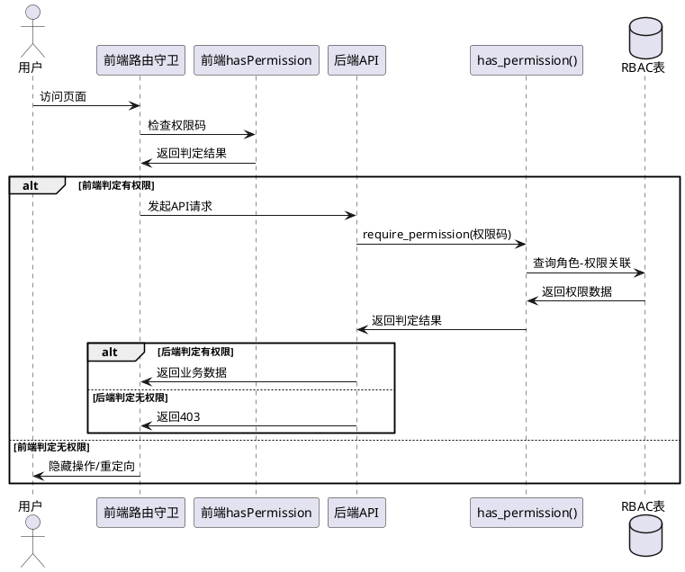

# WorkTrack v2 代码质量与RBAC权限系统优化需求规格

## 文档元数据

| 属性 | 值 |
|------|------|
| 版本 | v1.0 |
| 创建日期 | 2026-05-22 |
| 优先级说明 | P0=紧急(安全漏洞/数据丢失风险), P1=重要(功能缺陷/权限失效), P2=一般(代码质量/性能优化) |

---

# 1. 组件定位

## 1.1 核心职责

本组件负责修复 WorkTrack v2 系统中 RBAC 权限系统的缺陷、前后端不一致问题及代码质量问题，确保权限校验真实生效且前后端对齐。

## 1.2 核心输入

1. 用户登录后的 JWT Token 及其中包含的 permissions 列表
2. 各业务路由（日报/项目/客户/合同/会议/Wiki/看板）的 API 请求
3. 用户管理模块的角色分配和部门角色关联操作
4. 前端页面组件的权限守卫判定

## 1.3 核心输出

1. 一致的前后端权限校验结果（通过/拒绝）
2. 正确的行级数据访问控制结果
3. 修复后的无重复代码、无安全漏洞的 API 接口

## 1.4 职责边界

- 本组件不负责新增业务功能，仅修复已有缺陷和优化已有逻辑
- 本组件不负责 UI/UX 重新设计，仅修复因权限失效导致的功能问题
- 本组件不负责数据库 Schema 变更，仅修复数据访问逻辑

---

# 2. 领域术语

**RBAC**
: 基于角色的访问控制（Role-Based Access Control），通过角色-权限关联实现细粒度权限管理。

**原子权限**
: 最细粒度的权限单元，格式为 `模块:操作`，如 `customer:read`、`project:create`。

**行级访问控制**
: 基于数据所有者（owner_id）判断当前用户是否可访问该条数据，支持自己/部门负责人/老板三级判断。

**Legacy 权限字段**
: User 模型上遗留的 boolean 字段（`is_admin`、`use_shared_models`、`can_manage_models`），在 RBAC 引入前用于权限控制。

**权限三路径**
: `has_permission()` 函数中的三条判定路径：管理员全放行 → Legacy 字段兼容 → RBAC 表查询。

**Token Version**
: 用户模型上的版本号字段，用于使旧 JWT Token 失效，实现密码修改/管理员重置后的强制重新登录。

---

# 3. 问题清单

## 3.1 RBAC 权限系统问题

### BUG-RBAC-001: `has_permission()` 与 `get_user_permissions()` 角色来源不一致
- **文件**: `backend/app/auth.py` 第198-239行 vs 第242-285行
- **问题**: `has_permission()` 中的 `_check_rbac()` 通过 `UserRole`（用户直接角色）+ `DepartmentRole`（部门角色）查询权限；而 `get_user_permissions()` 通过 `UserRole` + `GroupRole`（用户组角色）查询权限。两者对"角色来源"的定义完全不同，导致后端 `has_permission()` 判定有权限，但前端拿到的 permissions 列表中可能不包含该权限（或反之）。
- **影响**: 前端基于 `user.permissions` 的 `hasPermission()` 与后端 `has_permission()` 判定结果不一致，部分权限在前端显示有权限但后端拒绝（或前端隐藏了实际有权限的操作）。
- **优先级**: P0

### BUG-RBAC-002: 前端 `hasPermission()` 未覆盖 Legacy 字段权限
- **文件**: `frontend/src/contexts/AuthContext.tsx` 第169-173行
- **问题**: 前端 `hasPermission()` 仅检查 `user.is_admin` 和 `user.permissions` 数组，但后端 `has_permission()` 还会通过 `_LEGACY_PERM_MAP` 检查 `use_shared_models` 和 `can_manage_models` 字段。登录时 `get_user_permissions()` 已补充了 Legacy 权限到 permissions 列表，但 `/auth/me` 接口也做了补充。然而，如果用户权限在登录后发生变化（管理员修改了角色），前端缓存的 permissions 不会更新。
- **影响**: 权限变更后用户需重新登录才能生效；若管理员修改了用户角色但用户未重新登录，前端仍按旧权限渲染。
- **优先级**: P1

### BUG-RBAC-003: `check_data_access()` 中部门角色与 manager 自动权限逻辑重叠
- **文件**: `backend/app/auth.py` 第303-352行
- **问题**: `check_data_access()` 中存在两段逻辑重叠：(1) 第336-343行检查 `dept_leader` 角色，(2) 第345-350行检查部门 manager 字段。两段逻辑都能放行同一请求，且第二段（manager 自动权限）不需要任何角色分配即可生效。这意味着只要用户是某个部门的 manager，即使没有分配 `dept_leader` 角色，也能查看部门所有成员数据。
- **影响**: 权限绕过风险——部门 manager 字段成为"隐式超级权限"，绕过 RBAC 角色体系。
- **优先级**: P0

### BUG-RBAC-004: 日报/项目/会议模块仅用 `get_current_user` 而非 `require_permission`
- **文件**: `backend/app/routers/daily_reports.py` 全文、`backend/app/routers/projects.py` 全文、`backend/app/routers/meetings.py` 全文
- **问题**: 日报、项目、会议三个模块的所有接口仅依赖 `get_current_user`（即仅验证登录），未使用 `require_permission()` 进行原子权限校验。对比客户/合同模块使用了 `require_permission("customer:read")` 等。这意味着即使 RBAC 系统定义了 `report:read`、`project:create` 等权限，这些模块也不会检查。
- **影响**: RBAC 对日报/项目/会议模块完全失效——所有登录用户都能执行所有操作。
- **优先级**: P0

### BUG-RBAC-005: Wiki 模块使用自建权限体系，未接入 RBAC
- **文件**: `backend/app/routers/wiki.py` 第22-71行
- **问题**: Wiki 模块使用 `_check_access()` / `_get_user_permission()` 实现独立的空间/页面级权限体系（viewer/editor/admin），与 RBAC 的 Permission/Role 体系完全独立。RBAC 中定义的 `wiki:read`、`wiki:edit` 等权限在 Wiki 路由中从未被检查。
- **影响**: RBAC 对 Wiki 模块失效，Wiki 权限由空间所有者自行管理，管理员无法通过 RBAC 统一管控。
- **优先级**: P1

### BUG-RBAC-006: `get_optional_user()` 未校验 token_version 和账号状态
- **文件**: `backend/app/auth.py` 第142-155行
- **问题**: `get_optional_user()` 在解析 Token 时，仅验证 JWT 签名有效性，不校验 `token_version`（密码修改后旧 Token 应失效）和账号状态（锁定/停用/离职）。这用于公开接口，但若公开接口后续添加了权限相关逻辑，可能导致已离职/已锁定用户仍能访问。
- **影响**: 潜在安全漏洞——已停用/已离职用户的 Token 仍然有效。
- **优先级**: P1

### BUG-RBAC-007: 前端路由守卫不完整
- **文件**: `frontend/src/App.tsx` 第668-684行
- **问题**: 前端路由仅对 `/customers` 和 `/contracts` 做了 `hasPermission` 守卫，其他模块（日报、项目、会议、AI、Wiki、看板、定时任务、设置）全部无权限守卫，任何登录用户可直接访问 URL 进入页面。用户管理页面仅检查 `isAdmin`（boolean 字段），未检查 `user:read` 权限。
- **影响**: 前端路由可被绕过——无权限用户通过直接输入 URL 即可进入受限页面。
- **优先级**: P1

### BUG-RBAC-008: RolePermission 表缺少唯一约束
- **文件**: `backend/app/models/rbac.py` 第32-37行
- **问题**: `RolePermission` 表的 `(role_id, permission_id)` 组合没有唯一约束，可能插入重复记录。类似地，`UserRole` 的 `(user_id, role_id)`、`DepartmentRole` 的 `(department_id, role_id)` 也缺少唯一约束。
- **影响**: 重复插入导致权限判定可能出现重复计算或数据冗余。
- **优先级**: P2

## 3.2 后端代码质量问题

### BUG-BE-001: 删除用户函数存在严重代码重复
- **文件**: `backend/app/routers/users.py` 第644-786行
- **问题**: `delete_user()` 函数中，从第744行开始重复了第668-742行完全相同的清理逻辑（UserGroup清理、UserRole清理、聊天记录清理、日报/会议/周报/偏好/项目/客户/合同/模型/提示词删除），导致所有关联数据被删除两次，且在 `db.commit()` 后再次查询已删除的数据。
- **影响**: 删除用户时执行重复的数据库操作，浪费性能且可能引发异常。
- **优先级**: P0

### BUG-BE-002: DepartmentRoleSet 类重复定义
- **文件**: `backend/app/routers/users.py` 第86行 vs 第144行
- **问题**: `DepartmentRoleSet` 类被定义了两次，第一次在第86行，第二次在第144行。Python 会使用后者覆盖前者，但这是明显的代码错误。
- **影响**: 代码维护混乱，可能引发难以排查的问题。
- **优先级**: P2

### BUG-BE-003: 合同搜索使用 `contains` 而非 `ilike`，大小写敏感
- **文件**: `backend/app/routers/contracts.py` 第48-53行
- **问题**: 合同列表搜索使用 `Contract.title.contains(keyword)` 等方法，这是大小写敏感的精确包含搜索，与用户列表中的 `ilike` 模糊搜索行为不一致。
- **影响**: 搜索体验不一致，用户输入小写关键词可能搜不到大写标题的合同。
- **优先级**: P2

### BUG-BE-004: Wiki 更新空间时残留调试 print 语句
- **文件**: `backend/app/routers/wiki.py` 第252行
- **问题**: `update_space()` 中有 `print("DEBUG UPDATE SPACE: ", update_data)` 调试语句残留。
- **影响**: 生产环境日志泄露，性能微弱影响。
- **优先级**: P2

### BUG-BE-005: 头像/音频文件服务接口无认证保护
- **文件**: `backend/app/routers/auth.py` 第220-226行、`backend/app/routers/meetings.py` 第212-219行
- **问题**: `serve_avatar()` 和 `serve_audio()` 接口无需任何认证即可访问，只要知道文件名即可下载。虽然文件名包含 UUID 部分使其难以猜测，但这不是真正的访问控制。
- **影响**: 知道文件名即可未授权下载用户头像和会议录音。
- **优先级**: P1

### BUG-BE-006: 合同后台解析使用 threading.Thread 而非 BackgroundTasks
- **文件**: `backend/app/routers/contracts.py` 第123行
- **问题**: `create_contract()` 中使用 `threading.Thread(target=_auto_parse_contract, ...)` 进行后台解析，而其他模块（日报/项目/会议）统一使用 FastAPI 的 `BackgroundTasks`。`threading.Thread` 绕过了 FastAPI 的生命周期管理，在应用关闭时可能导致线程未正确清理。且 `_auto_parse_contract` 内部手动创建 `Session(engine)` 而非依赖注入。
- **影响**: 线程安全风险，应用关闭时可能数据不一致。
- **优先级**: P1

### BUG-BE-007: Dashboard 连续天数统计存在 N+1 查询
- **文件**: `backend/app/routers/dashboard.py` 第210-227行
- **问题**: `streak_days` 计算循环中，每个工作日都执行一次 `db.exec(select(DailyReport).where(...))` 查询，最多90次独立查询。应改为一次批量查询所有工作日的日报。
- **影响**: 性能问题——每次访问看板可能触发90次数据库查询。
- **优先级**: P2

### BUG-BE-008: Dashboard 全量加载数据后在 Python 中过滤
- **文件**: `backend/app/routers/dashboard.py` 第86-117行
- **问题**: `get_stats()` 将用户所有项目、客户全量加载到内存，然后在 Python 中按日期过滤。应使用 SQL WHERE 条件在数据库层完成过滤。
- **影响**: 数据量大时内存占用高，响应慢。
- **优先级**: P2

### BUG-BE-009: AI 对话列表 N+1 查询
- **文件**: `backend/app/routers/ai_agent.py` 第76-91行
- **问题**: `list_conversations()` 先查所有对话，再逐个查询每个对话的消息数量，典型的 N+1 问题。
- **影响**: 对话数量多时性能差。
- **优先级**: P2

### BUG-BE-010: `system-info` 接口全量加载用户和供应商
- **文件**: `backend/app/routers/settings.py` 第1024-1031行
- **问题**: `system_info()` 使用 `db.exec(select(ModelProvider)).all()` 和 `db.exec(select(User)).all()` 全量加载，应使用 `func.count()` 统计。
- **影响**: 用户/供应商数量大时内存浪费。
- **优先级**: P2

### BUG-BE-011: 模型测试接口无认证
- **文件**: `backend/app/routers/settings.py` 第265-323行、第326-397行
- **问题**: `test_provider_model()` 和 `test_provider()` 接口没有 `current_user` 依赖注入，任何未认证用户都可以触发模型测试，可能被滥用消耗 API 额度。
- **影响**: 安全风险——未认证用户可触发外部 API 调用。
- **优先级**: P1

### BUG-BE-012: 字段选项列表接口无认证
- **文件**: `backend/app/routers/settings.py` 第529-535行、第588-593行
- **问题**: `list_field_options()` 和 `list_field_categories()` 接口无认证保护，任何人可查看系统配置。
- **影响**: 信息泄露风险。
- **优先级**: P2

## 3.3 前端代码质量问题

### BUG-FE-001: 全局 fetch 拦截器导致请求重复携带 Authorization
- **文件**: `frontend/src/contexts/AuthContext.tsx` 第53-82行
- **问题**: `AuthProvider` 中通过 `window.fetch = ...` 全局拦截 `/api/` 请求添加 Authorization header。但同时 `fetchWithAuth` 函数也会添加 Authorization header。使用 `fetchWithAuth` 发起的请求会被拦截器再添加一次 header（虽然 `headers.has('Authorization')` 检查会跳过）。更严重的是，全局拦截器在 `useEffect` 中设置，其清理函数在组件卸载时恢复原始 fetch，但如果 `AuthProvider` 重新挂载（如 React Strict Mode），可能导致拦截器设置异常。
- **影响**: 潜在的请求头异常；React Strict Mode 下可能引发拦截器叠加。
- **优先级**: P1

### BUG-FE-002: 前端 API 调用未统一使用 `fetchWithAuth`
- **文件**: `frontend/src/pages/ProjectsPage.tsx` 第74行等多处
- **问题**: ProjectsPage 等页面直接使用 `fetch(url, { headers: { Authorization: ... } })` 而非 `fetchWithAuth`，虽然有全局拦截器兜底，但代码风格不一致，且手动设置的 header 与拦截器可能冲突。
- **影响**: 代码维护性差；若全局拦截器被移除则所有手动调用失效。
- **优先级**: P2

### BUG-FE-003: ProjectsPage 缺少权限守卫——任何人可创建/删除项目
- **文件**: `frontend/src/pages/ProjectsPage.tsx` 第371-375行
- **问题**: 项目创建按钮使用 `hasPermission('project:create')` 控制，但项目删除按钮（第718-720行）使用 `hasPermission('project:delete')`。然而后端 `projects.py` 根本不检查这些权限，前端守卫形同虚设——直接调用 API 即可绕过。更关键的是，编辑/删除操作仅检查 `project.user_id != current_user.id`，部门负责人/老板无法通过前端操作他人的项目。
- **影响**: 前端权限守卫与后端不一致；管理者无法在前端操作下属数据。
- **优先级**: P1

### BUG-FE-004: 前端页面状态过多，组件过度渲染
- **文件**: `frontend/src/pages/ProjectsPage.tsx` 第29-69行
- **问题**: ProjectsPage 中定义了20+个 `useState`，每次任一状态变更都触发整个页面重新渲染。未使用 `useMemo`/`useCallback` 优化派生状态的计算（筛选计数等在每次渲染时重新计算）。
- **影响**: 大量数据时页面卡顿。
- **优先级**: P2

### BUG-FE-005: API 错误处理不完善
- **文件**: `frontend/src/pages/ProjectsPage.tsx` 第74-76行等多处
- **问题**: 大量 API 调用的 `.catch()` 为空或仅设置 `setLoading(false)`，不处理 401/403 等认证错误。当 Token 过期时，用户看到的是空白页面而非登录跳转。
- **影响**: 用户体验差——Token 过期后无提示。
- **优先级**: P1

### BUG-FE-006: 前端未处理 API 返回分页数据格式
- **文件**: `frontend/src/pages/ProjectsPage.tsx` 第75行
- **问题**: `loadProjects` 中 `setProjects(Array.isArray(data) ? data : [])`，但后端用户列表支持分页返回 `{ items, total, page, page_size, total_pages }` 格式。虽然项目列表目前不分页，但若后续添加分页，前端需适配。
- **影响**: 潜在的兼容性问题。
- **优先级**: P2

## 3.4 前后端一致性问题

### BUG-CONSIST-001: 前端 User 类型定义与后端 `/auth/me` 响应不完全匹配
- **文件**: `frontend/src/contexts/AuthContext.tsx` 第3-15行 vs `backend/app/routers/auth.py` 第166-181行
- **问题**: 前端 `User` 接口包含 `permissions?: string[]`（可选），后端 `/auth/me` 返回 `permissions`（必填）。前端 `User` 缺少 `status`、`job_title`、`department_id`、`leader_id` 等字段，虽然前端不使用这些字段，但类型定义不对称。
- **影响**: 类型安全性降低；若后续前端需要使用这些字段需重新对接。
- **优先级**: P2

### BUG-CONSIST-002: 前端权限码与后端定义不完全对齐
- **文件**: `frontend/src/App.tsx` 第453/487/674/675行 vs `backend/app/routers/` 各模块
- **问题**: 前端使用 `customer:read`、`contract:read`、`project:view_all`、`project:create`、`project:edit`、`project:delete` 等权限码，但后端日报/项目/会议模块不检查任何权限码，客户/合同模块检查的权限码（如 `customer:read`、`contract:read`）虽存在但仅通过 `require_permission()` 检查。前端使用的 `project:view_all` 在后端从未被定义或检查。
- **影响**: 前端权限码为"幻觉权限"——看起来有权限控制实际没有。
- **优先级**: P0

### BUG-CONSIST-003: 登录接口返回的 user 对象字段不完整
- **文件**: `backend/app/routers/auth.py` 第81-88行（register）和第112-120行（login）
- **问题**: `/auth/login` 和 `/auth/register` 返回的 user 对象仅包含 `id, username, name, is_admin, can_manage_models, use_shared_models, permissions`，缺少 `email, is_active, avatar, last_login_at` 等字段。而 `/auth/me` 返回完整字段。前端登录后用这个不完整的 user 对象设置状态，直到页面刷新触发 `/auth/me` 才获取完整数据。
- **影响**: 登录后立即显示的用户信息（如头像、邮箱）可能缺失。
- **优先级**: P2

---

# 4. DFX约束

## 4.1 性能

1. 权限校验接口响应时间不得超过 50ms（P95）
2. Dashboard 统计接口响应时间不得超过 500ms（P95）
3. 删除用户操作应在 5s 内完成（含关联数据清理）

## 4.2 可靠性

1. 权限校验结果前后端一致性必须达到 100%
2. 删除用户操作必须保证原子性——关联数据全部清理成功或全部回滚
3. Token 失效机制必须确保密码修改后旧 Token 在 1s 内无法使用

## 4.3 安全性

1. 所有 `/api/` 接口必须经过认证校验（公开接口除外）
2. 文件服务接口必须验证请求者身份或使用不可猜测的签名 URL
3. 权限校验必须以服务端为准，前端仅作 UI 层面的辅助控制
4. 敏感操作（删除用户、重置密码、修改角色）必须记录审计日志

## 4.4 可维护性

1. 权限校验逻辑应统一入口，避免各模块各自实现
2. 前端 API 调用应统一使用 `fetchWithAuth` 封装
3. 后台任务应统一使用 FastAPI BackgroundTasks，禁止裸线程

---

# 5. 核心能力

## 5.1 RBAC 权限校验一致性修复

### 5.1.1 业务规则

1. **角色来源统一规则**：`has_permission()` 与 `get_user_permissions()` 必须使用相同的角色来源逻辑，统一为 UserRole + DepartmentRole + GroupRole 三者合并。

   a. 验收条件：When 用户被分配了部门角色但无直接角色，`has_permission()` 返回 True 的权限，前端 `hasPermission()` 也应返回 True。

2. **权限三路径优先级规则**：管理员全放行 > Legacy 字段兼容 > RBAC 表查询，三路径必须保持一致且无遗漏。

   a. 验收条件：While 用户 `use_shared_models=True` 且无 RBAC 角色分配，`has_permission("ai:use")` 返回 True，且该权限出现在 `get_user_permissions()` 返回列表中。

3. **部门 manager 隐式权限消除规则**：`check_data_access()` 中的部门 manager 自动权限必须依赖显式角色分配，不再仅凭 manager 字段放行。

   a. 验收条件：If 用户是某部门的 manager 但未被分配 `dept_leader` 角色，该用户不能查看部门其他成员的日报数据。

4. **日报/项目/会议模块权限接入规则**：所有业务模块的 API 接口必须通过 `require_permission()` 进行原子权限校验，不再仅依赖 `get_current_user`。

   a. 验收条件：When 用户无 `report:read` 权限访问日报列表接口，the 系统应返回 HTTP 403。

5. **Wiki 模块 RBAC 接入规则**：Wiki 模块的空间/页面级权限体系必须与 RBAC 体系协同，RBAC 权限码 `wiki:read`/`wiki:edit`/`wiki:admin` 应作为 Wiki 访问的前置条件。

   a. 验收条件：Where 用户无 `wiki:read` 权限，即使被 Wiki 空间授权为 viewer，也应被系统拒绝访问。

6. **前端路由守卫完备规则**：所有需要权限的页面路由必须添加 `hasPermission` 守卫，守卫使用的权限码必须与后端实际检查的权限码一致。

   a. 验收条件：When 无 `report:read` 权限的用户直接访问 `/reports` URL，the 前端应重定向到首页或显示无权限提示。

### 5.1.2 交互流程

### 5.1.3 异常场景

1. **权限变更未即时生效**

   a. 触发条件：管理员修改了用户角色，用户未重新登录
   b. 系统行为：前端使用缓存的旧 permissions 列表，后端使用数据库中的新权限
   c. 用户感知：前端显示有权限的按钮，但点击后后端返回403

2. **角色来源不一致导致权限"幻觉"**

   a. 触发条件：用户通过 DepartmentRole 获得了某权限，但 `get_user_permissions()` 不查询 DepartmentRole
   b. 系统行为：后端 `has_permission()` 返回 True（通过 _check_rbac），前端 `hasPermission()` 返回 False（permissions 列表中无该权限）
   c. 用户感知：后端允许操作但前端隐藏了操作入口

## 5.2 后端代码缺陷修复

### 5.2.1 业务规则

1. **删除用户原子性规则**：删除用户时，关联数据清理必须只执行一次，且在 `db.commit()` 前完成所有清理。

   a. 验收条件：When 管理员删除用户，the 系统应仅执行一次关联数据清理并成功提交。

2. **模型测试接口认证规则**：所有触发外部 API 调用的接口必须经过认证。

   a. 验收条件：If 未认证用户访问 `/settings/providers/{id}/test`，the 系统应返回 HTTP 401。

3. **文件服务认证规则**：头像和音频文件服务接口必须验证请求者身份。

   a. 验收条件：If 未认证用户请求 `/auth/avatar-file/{filename}`，the 系统应返回 HTTP 401。

4. **后台任务统一规则**：禁止使用 `threading.Thread`，所有后台任务必须使用 FastAPI `BackgroundTasks`。

   a. 验收条件：When 创建合同触发后台解析，the 系统应使用 BackgroundTasks 而非 threading.Thread。

5. **调试代码清除规则**：生产代码中不得包含 `print()` 调试语句。

   a. 验收条件：The 代码库中不应存在任何 `print("DEBUG` 模式的语句。

### 5.2.2 异常场景

1. **删除用户关联数据清理失败**

   a. 触发条件：删除用户时某关联表外键约束导致删除失败
   b. 系统行为：整个删除事务回滚，用户保留
   c. 用户感知：提示"删除失败，请稍后重试"

2. **后台合同解析线程异常**

   a. 触发条件：`threading.Thread` 中的解析逻辑抛出未捕获异常
   b. 系统行为：线程静默失败，合同 raw_text 保持为空
   c. 用户感知：合同上传后解析状态一直为空，无错误提示

## 5.3 前端代码质量优化

### 5.3.1 业务规则

1. **API 调用统一规则**：所有 API 调用必须使用 `fetchWithAuth` 或依赖全局拦截器，禁止手动拼接 Authorization header。

   a. 验收条件：The 代码库中不应存在 `localStorage.getItem('auth_token')` 在 fetch 调用中的直接使用。

2. **API 错误处理统一规则**：所有 API 调用必须处理 401（跳转登录）和 403（提示无权限）响应。

   a. 验收条件：When API 返回 HTTP 401，the 前端应自动跳转到登录页面。

3. **全局 fetch 拦截器安全规则**：拦截器必须正确处理 React Strict Mode 下的双重挂载，避免拦截器叠加。

   a. 验收条件：While React Strict Mode 启用，全局 fetch 拦截器仅设置一次，不随组件重渲染叠加。

### 5.3.2 异常场景

1. **Token 过期后页面空白**

   a. 触发条件：用户 Token 过期后操作页面
   b. 系统行为：API 返回 401，前端跳转登录页
   c. 用户感知：提示"登录已过期，请重新登录"并跳转登录页

## 5.4 前后端一致性保障

### 5.4.1 业务规则

1. **权限码定义同步规则**：前端使用的所有权限码必须与后端 Permission 表中定义的权限码完全一致，不存在的权限码不得在前端使用。

   a. 验收条件：The 前端代码中使用的 `project:view_all` 等权限码必须与后端 Permission 表中的 code 字段一一对应。

2. **登录响应完整性规则**：`/auth/login` 返回的 user 对象字段必须与 `/auth/me` 返回的字段一致。

   a. 验收条件：When 用户登录成功，返回的 user 对象应包含 `email, is_active, avatar, last_login_at, permissions` 等完整字段。

3. **`get_optional_user()` 安全补全规则**：`get_optional_user()` 必须校验 token_version 和账号状态，与 `get_current_user()` 保持一致。

   a. 验收条件：If 已离职用户的 Token 仍有效（未过期），`get_optional_user()` 应返回 None 而非用户对象。

---

# 6. 优化需求清单（EARS格式）

## P0 紧急

### REQ-001: 统一 has_permission() 与 get_user_permissions() 的角色来源
- **类型**: Event-Driven
- **描述**: When 系统执行权限判定，the 权限校验模块 shall 统一使用 UserRole + DepartmentRole + GroupRole 三种角色来源进行权限计算，确保 `has_permission()` 与 `get_user_permissions()` 返回结果一致。
- **验收标准**: 
  - When 用户通过 DepartmentRole 获得某权限，`has_permission()` 返回 True 且该权限出现在 `get_user_permissions()` 列表中
  - When 用户通过 GroupRole 获得某权限，`has_permission()` 返回 True 且该权限出现在 `get_user_permissions()` 列表中
- **关联问题**: BUG-RBAC-001

### REQ-002: 消除 check_data_access() 中的隐式 manager 权限
- **类型**: State-Driven
- **描述**: While 用户仅凭部门 manager 字段而无 dept_leader 角色分配，the 行级访问控制模块 shall 拒绝该用户访问部门其他成员的数据。
- **验收标准**:
  - If 用户是某部门 manager 但无 dept_leader 角色，访问部门成员日报应返回 403
  - If 用户是某部门 manager 且有 dept_leader 角色，访问部门成员日报应返回 200
- **关联问题**: BUG-RBAC-003

### REQ-003: 日报/项目/会议模块接入 RBAC 权限校验
- **类型**: Ubiquitous
- **描述**: The 日报、项目、会议模块的 API 接口 shall 通过 `require_permission()` 进行原子权限校验，不再仅依赖 `get_current_user`。
- **验收标准**:
  - When 无 `report:read` 权限的用户访问日报列表，返回 403
  - When 无 `project:create` 权限的用户创建项目，返回 403
  - When 无 `meeting:read` 权限的用户访问会议列表，返回 403
  - When 有相应权限的用户操作，正常返回数据
- **关联问题**: BUG-RBAC-004

### REQ-004: 修复删除用户函数中的代码重复
- **类型**: Event-Driven
- **描述**: When 管理员删除用户，the 系统 shall 仅执行一次关联数据清理逻辑，确保在 `db.commit()` 前完成所有清理且不重复执行。
- **验收标准**:
  - 删除用户时每个关联表的清理操作仅执行一次
  - 删除用户后所有关联数据（Wiki/聊天/日报/项目/客户/合同等）均被正确清理
- **关联问题**: BUG-BE-001

### REQ-005: 消除前端"幻觉权限码"
- **类型**: Ubiquitous
- **描述**: The 前端使用的所有权限码 shall 与后端 Permission 表中定义的权限码完全对应，不存在的权限码不得在前端使用。
- **验收标准**:
  - 前端 `hasPermission('project:view_all')` 等调用对应的权限码必须存在于后端 Permission 表
  - 若后端未定义某权限码，前端不得使用该码进行权限守卫
- **关联问题**: BUG-CONSIST-002

## P1 重要

### REQ-006: 补全前端路由权限守卫
- **类型**: Ubiquitous
- **描述**: The 前端所有需要权限的页面路由 shall 添加 `hasPermission` 守卫，守卫使用的权限码须与后端一致。
- **验收标准**:
  - `/reports` 路由守卫 `hasPermission('report:read')`
  - `/projects` 路由守卫 `hasPermission('project:read')`
  - `/meetings` 路由守卫 `hasPermission('meeting:read')`
  - `/ai` 路由守卫 `hasPermission('ai:use')`
  - `/wiki` 路由守卫 `hasPermission('wiki:read')`
  - `/dashboard` 路由守卫 `hasPermission('dashboard:read')`
  - `/tasks` 路由守卫 `hasPermission('task:read')`
  - `/users` 路由守卫 `hasPermission('user:read')`（替代 `isAdmin`）
  - 无权限用户直接访问 URL 时重定向到首页
- **关联问题**: BUG-RBAC-007

### REQ-007: 补全 get_optional_user() 的安全校验
- **类型**: Event-Driven
- **描述**: When `get_optional_user()` 解析 Token，the 认证模块 shall 校验 token_version 和账号状态（锁定/停用/离职），与 `get_current_user()` 保持一致。
- **验收标准**:
  - If 用户已离职，`get_optional_user()` 返回 None
  - If Token 的 token_version 与用户当前版本不一致，`get_optional_user()` 返回 None
- **关联问题**: BUG-RBAC-006

### REQ-008: Wiki 模块接入 RBAC 前置权限
- **类型**: Optional Feature
- **描述**: Where 用户访问 Wiki 功能，the Wiki 模块 shall 先校验 RBAC 权限码 `wiki:read`/`wiki:edit`/`wiki:admin`，通过后再执行空间/页面级权限判定。
- **验收标准**:
  - 无 `wiki:read` 权限的用户访问 Wiki 空间列表返回 403
  - 有 `wiki:read` 权限但无空间授权的用户可看到空列表（不报错）
- **关联问题**: BUG-RBAC-005

### REQ-009: 文件服务接口添加认证保护
- **类型**: Ubiquitous
- **描述**: The 头像和音频文件服务接口 shall 验证请求者身份，未认证请求返回 401。
- **验收标准**:
  - 未认证请求 `/auth/avatar-file/{filename}` 返回 401
  - 未认证请求 `/meetings/audio/{filename}` 返回 401
  - 已认证用户可正常获取文件
- **关联问题**: BUG-BE-005

### REQ-010: 模型测试接口添加认证保护
- **类型**: Ubiquitous
- **描述**: The 模型供应商测试和模型测试接口 shall 要求用户认证。
- **验收标准**:
  - 未认证请求 `/settings/providers/{id}/test` 返回 401
  - 未认证请求 `/settings/providers/{id}/models/{mid}/test` 返回 401
- **关联问题**: BUG-BE-011

### REQ-011: 合同后台解析改用 BackgroundTasks
- **类型**: Event-Driven
- **描述**: When 创建合同触发后台解析，the 系统 shall 使用 FastAPI BackgroundTasks 而非 threading.Thread。
- **验收标准**:
  - 合同解析不再使用 `threading.Thread`
  - 解析逻辑使用依赖注入的数据库 Session
- **关联问题**: BUG-BE-006

### REQ-012: 前端 API 错误处理统一
- **类型**: Event-Driven
- **描述**: When API 返回 HTTP 401，the 前端 shall 自动跳转到登录页面并提示"登录已过期"。When API 返回 HTTP 403，the 前端 shall 显示"无权限"提示。
- **验收标准**:
  - Token 过期后任何操作自动跳转登录页
  - 无权限操作显示友好的错误提示
- **关联问题**: BUG-FE-005

### REQ-013: 修复全局 fetch 拦截器 Strict Mode 兼容性
- **类型**: State-Driven
- **描述**: While React Strict Mode 启用，the 全局 fetch 拦截器 shall 仅设置一次，不随组件重渲染叠加。
- **验收标准**:
  - Strict Mode 下拦截器不重复设置
  - 组件卸载时正确恢复原始 fetch
- **关联问题**: BUG-FE-001

### REQ-014: 前端项目/会议/日报管理者操作支持
- **类型**: Event-Driven
- **描述**: When 部门负责人或老板查看下属的日报/项目/会议，the 前端 shall 显示编辑/删除操作入口（基于后端 `check_data_access` 返回结果）。
- **验收标准**:
  - 部门负责人可编辑/删除下属的日报
  - 老板可查看/编辑/删除所有成员的数据
- **关联问题**: BUG-FE-003

## P2 一般

### REQ-015: Dashboard 连续天数查询优化
- **类型**: Ubiquitous
- **描述**: The Dashboard 统计接口 shall 使用批量查询替代循环逐日查询，将连续天数计算的数据库查询次数从最多90次降为1次。
- **验收标准**:
  - `get_stats()` 接口中 streak_days 计算仅使用1次数据库查询
  - 响应时间 P95 < 500ms
- **关联问题**: BUG-BE-007

### REQ-016: Dashboard 统计接口数据库层过滤
- **类型**: Ubiquitous
- **描述**: The Dashboard 统计接口 shall 使用 SQL WHERE 条件在数据库层完成日期范围过滤，不再全量加载到 Python 内存中过滤。
- **验收标准**:
  - 项目/客户统计使用 SQL WHERE 过滤日期范围
  - 不再使用 `db.exec(select(Model).where(...)).all()` 后 Python 过滤
- **关联问题**: BUG-BE-008

### REQ-017: AI 对话列表 N+1 查询优化
- **类型**: Event-Driven
- **描述**: When 获取对话列表，the AI Agent 模块 shall 使用 JOIN 或子查询一次性获取每个对话的消息数量，替代逐个查询。
- **验收标准**:
  - `list_conversations()` 接口仅使用1次 JOIN 查询获取对话及消息数量
- **关联问题**: BUG-BE-009

### REQ-018: system-info 接口计数优化
- **类型**: Ubiquitous
- **描述**: The system-info 接口 shall 使用 `func.count()` 统计用户和供应商数量，不再全量加载。
- **验收标准**:
  - 接口不再使用 `.all()` 加载全量数据
  - 使用 `func.count()` 进行数据库层计数
- **关联问题**: BUG-BE-010

### REQ-019: 合同搜索改用 ilike 模糊匹配
- **类型**: Event-Driven
- **描述**: When 用户搜索合同关键词，the 合同模块 shall 使用大小写不敏感的模糊匹配（ilike），与用户列表搜索行为一致。
- **验收标准**:
  - 输入小写关键词可匹配到大写标题的合同
  - 搜索行为与用户列表搜索一致
- **关联问题**: BUG-BE-003

### REQ-020: 清除 Wiki 调试代码
- **类型**: Ubiquitous
- **描述**: The 生产代码中 shall 不包含任何 `print("DEBUG")` 调试语句。
- **验收标准**:
  - 代码库中搜索 `print("DEBUG` 无结果
- **关联问题**: BUG-BE-004

### REQ-021: 修复 DepartmentRoleSet 重复定义
- **类型**: Ubiquitous
- **描述**: The 用户管理路由中 shall 仅保留一个 `DepartmentRoleSet` 类定义。
- **验收标准**:
  - `users.py` 中 `DepartmentRoleSet` 仅定义一次
- **关联问题**: BUG-BE-002

### REQ-022: 前端 API 调用统一使用 fetchWithAuth
- **类型**: Ubiquitous
- **描述**: The 前端所有 API 调用 shall 使用 `fetchWithAuth` 封装或依赖全局拦截器，禁止手动拼接 Authorization header。
- **验收标准**:
  - 代码中不再存在 `localStorage.getItem('auth_token')` 在 fetch 中的直接使用
- **关联问题**: BUG-FE-002

### REQ-023: 登录响应字段完整性
- **类型**: Event-Driven
- **描述**: When 用户登录成功，the 认证接口 shall 返回与 `/auth/me` 一致的完整用户字段。
- **验收标准**:
  - 登录响应包含 `email, is_active, avatar, last_login_at, permissions` 等完整字段
  - 登录后无需刷新即可显示头像和邮箱
- **关联问题**: BUG-CONSIST-003

### REQ-024: RBAC 关联表添加唯一约束
- **类型**: Ubiquitous
- **描述**: The RolePermission、UserRole、DepartmentRole 表 shall 添加联合唯一约束，防止重复记录。
- **验收标准**:
  - `RolePermission(role_id, permission_id)` 组合唯一
  - `UserRole(user_id, role_id)` 组合唯一
  - `DepartmentRole(department_id, role_id)` 组合唯一
  - 重复插入时数据库拒绝并返回约束冲突错误
- **关联问题**: BUG-RBAC-008

### REQ-025: 字段选项列表接口添加认证
- **类型**: Ubiquitous
- **描述**: The 字段选项列表接口 shall 要求用户认证。
- **验收标准**:
  - 未认证请求 `/settings/field-options` 返回 401
  - 已认证用户可正常获取选项
- **关联问题**: BUG-BE-012

---

# 7. 优先级排序汇总

| 优先级 | 需求ID | 需求名称 | 关联问题 |
|--------|--------|----------|----------|
| P0 | REQ-001 | 统一 has_permission() 与 get_user_permissions() 的角色来源 | BUG-RBAC-001 |
| P0 | REQ-002 | 消除 check_data_access() 中的隐式 manager 权限 | BUG-RBAC-003 |
| P0 | REQ-003 | 日报/项目/会议模块接入 RBAC 权限校验 | BUG-RBAC-004 |
| P0 | REQ-004 | 修复删除用户函数中的代码重复 | BUG-BE-001 |
| P0 | REQ-005 | 消除前端"幻觉权限码" | BUG-CONSIST-002 |
| P1 | REQ-006 | 补全前端路由权限守卫 | BUG-RBAC-007 |
| P1 | REQ-007 | 补全 get_optional_user() 的安全校验 | BUG-RBAC-006 |
| P1 | REQ-008 | Wiki 模块接入 RBAC 前置权限 | BUG-RBAC-005 |
| P1 | REQ-009 | 文件服务接口添加认证保护 | BUG-BE-005 |
| P1 | REQ-010 | 模型测试接口添加认证保护 | BUG-BE-011 |
| P1 | REQ-011 | 合同后台解析改用 BackgroundTasks | BUG-BE-006 |
| P1 | REQ-012 | 前端 API 错误处理统一 | BUG-FE-005 |
| P1 | REQ-013 | 修复全局 fetch 拦截器 Strict Mode 兼容性 | BUG-FE-001 |
| P1 | REQ-014 | 前端项目/会议/日报管理者操作支持 | BUG-FE-003 |
| P2 | REQ-015 | Dashboard 连续天数查询优化 | BUG-BE-007 |
| P2 | REQ-016 | Dashboard 统计接口数据库层过滤 | BUG-BE-008 |
| P2 | REQ-017 | AI 对话列表 N+1 查询优化 | BUG-BE-009 |
| P2 | REQ-018 | system-info 接口计数优化 | BUG-BE-010 |
| P2 | REQ-019 | 合同搜索改用 ilike 模糊匹配 | BUG-BE-003 |
| P2 | REQ-020 | 清除 Wiki 调试代码 | BUG-BE-004 |
| P2 | REQ-021 | 修复 DepartmentRoleSet 重复定义 | BUG-BE-002 |
| P2 | REQ-022 | 前端 API 调用统一使用 fetchWithAuth | BUG-FE-002 |
| P2 | REQ-023 | 登录响应字段完整性 | BUG-CONSIST-003 |
| P2 | REQ-024 | RBAC 关联表添加唯一约束 | BUG-RBAC-008 |
| P2 | REQ-025 | 字段选项列表接口添加认证 | BUG-BE-012 |
